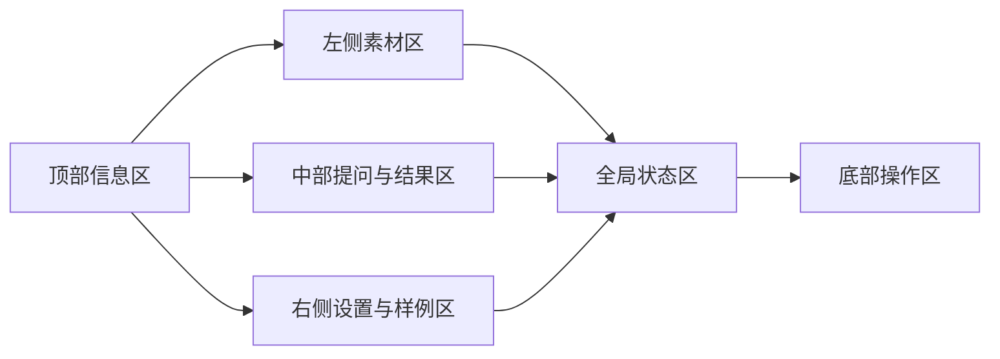
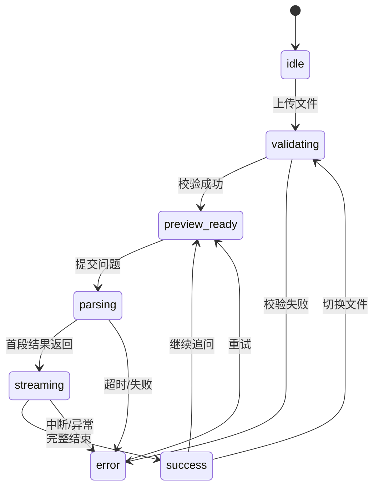

# SnapExtract 前端规格说明（Frontend Spec）

版本号：V1.0.0

| 版本 | 时间 | 修订人 | 备注 |
|------|------|--------|------|
| V1.0.0 | 2026/04/23 | Codex | 基于决赛版 PRD 抽取的前端专用执行规格 |

## 1. 文档目标
本文件用于指导 SnapExtract 前端的短期重构与中期产品化迁移，作为前端、产品、设计、后端协作时的单独规格文件。

本文件不重复解释模型方案与完整业务背景，只聚焦以下问题：
1. 当前比赛版前端应该做成什么样。
2. 页面结构、状态、交互和组件边界如何定义。
3. 哪些能力可以继续放在 Gradio 中实现，哪些能力要留给赛后正式 Web 前端。
4. 前后端边界、前端状态模型和迁移约束如何定义。

## 2. 适用范围

### 2.1 当前阶段
当前阶段为决赛版交付阶段，前端展示层继续使用 Gradio，但页面结构和状态设计必须按照正式产品的思路组织，避免赛后完全推翻。

### 2.2 后续阶段
赛后产品化阶段，前端将迁移到正式 Web 技术栈。当前阶段输出的页面模块、状态命名、数据结构和交互逻辑，应尽可能与后续正式前端兼容。

### 2.3 本文件不覆盖
1. 模型训练、推理优化、NPU 细节。
2. 后端接口的完整技术实现方案。
3. 数据库表设计和部署方案。

## 3. 前端目标

### 3.1 短期目标（决赛版）
1. 将当前“上传 + 提问 + 输出”的简单页面升级为可演示的完整工作界面。
2. 解决历史预览残留、任务串台、状态不清、设置缺失等问题。
3. 让评委在 2 分钟内可以看懂产品结构和核心能力。
4. 保持 Gradio 的开发效率，不在比赛前引入大规模技术栈重写风险。

### 3.2 中期目标（产品化）
1. 迁移到正式 Web 前端框架。
2. 前端不再直接绑定推理细节，而是通过业务服务层调用 AI 能力。
3. 支持产品工作台、历史任务、设置中心、导出能力和后续用户体系。

## 4. 用户与使用场景

| 角色 | 使用场景 | 前端核心目标 |
|------|---------|-------------|
| 评委/演示观看者 | 现场观看产品演示 | 快速建立对产品价值与流程的认知 |
| 演示操作者 | 现场上传样例、提问、切换设置、处理异常 | 少步骤、低出错、强可控 |
| 办公/学习用户 | 上传文件并提问获取结果 | 页面结构清晰，反馈及时 |
| 系统维护者 | 调整模型、模板和样例配置 | 可配置、可诊断、边界清晰 |

## 5. 页面信息架构

### 5.1 决赛版主界面
主界面必须拆成六个功能区，不能继续维持“左上传右问答”的极简松散结构。

### 5.2 六个功能区定义

| 区域 | 必须包含 | 说明 |
|------|---------|------|
| 顶部信息区 | 产品标题、当前模式、核心价值短描述 | 建立产品感与演示语境 |
| 左侧素材区 | 上传区、文件信息、预览区、清空入口 | 承载素材导入与预览 |
| 中部提问与结果区 | 提问输入、快捷问题、提交按钮、结果面板 | 承载核心交互闭环 |
| 右侧设置与样例区 | 设置中心、推荐样例、快捷模式入口 | 提升演示可控性 |
| 全局状态区 | 当前任务状态、错误提示、低置信度提示 | 承载统一状态反馈 |
| 底部操作区 | 复制、导出、重试、恢复默认 | 承载后续动作 |

### 5.3 正式产品前端导航预留
虽然决赛版仍然是单页，但信息架构必须预留未来产品导航概念：
1. 工作台
2. 历史任务
3. 设置中心
4. 样例与素材
5. 管理入口 [待确认]

## 6. 页面模块规格

### 6.1 顶部信息区

#### 目标
提升产品完成度和品牌感，避免页面看起来像纯工具脚本。

#### 必须元素
| 元素 | 类型 | 必填 | 默认值 | 规则 |
|------|------|------|--------|------|
| 产品名 | 文本 | 是 | SnapExtract | 固定展示 |
| 副标题 | 文本 | 是 | 基于骁龙端侧 NPU 的视觉理解助手 | 一句话说明价值 |
| 当前模式标签 | 标签 | 是 | 演示模式/普通模式 | 与当前模式联动 |
| 环境状态点 | 状态点 | 是 | 正常 | 启动异常时显示告警 |

### 6.2 素材区

#### 目标
让用户在上传文件后，对“当前操作对象”建立明确认知。

#### 子模块
1. 上传入口
2. 文件元信息展示
3. 预览区
4. 清空与重新上传

#### 交互规则
| 规则 | 说明 |
|------|------|
| 新文件上传成功后 | 必须清空旧任务结果、旧状态和旧预览缓存 |
| 文件校验失败后 | 不得保留上一次有效任务的视觉残留 |
| 预览失败后 | 结果区不可继续提交问题 |
| 文件切换后 | 必须生成新的 task_id |

### 6.3 提问区

#### 目标
降低用户发起问题的思考成本，并保持提交流程稳定。

#### 必须元素
| 元素 | 类型 | 必填 | 默认值 | 规则 |
|------|------|------|--------|------|
| 提问输入框 | 多行输入 | 是 | 根据文件类型显示示例问题 | 字数上限 [待确认] |
| 快捷问题 | 按钮组 | 否 | 按素材类型动态展示 | 点击后自动填充 |
| 提交按钮 | 按钮 | 是 | 启用 | 请求中禁用 |
| 重试按钮 | 按钮 | 否 | 隐藏 | 失败后出现 |

#### 交互规则
1. 未上传有效素材时，提交按钮置灰。
2. 请求中禁止重复提交。
3. 问题为空时不可提交。
4. 快捷问题的文案必须与当前文件类型匹配。

### 6.4 结果区

#### 目标
让结果可读、可信、可继续操作。

#### 必须元素
| 元素 | 类型 | 必填 | 默认值 | 规则 |
|------|------|------|--------|------|
| 结果面板 | 内容容器 | 是 | 空状态提示 | 仅展示当前任务结果 |
| 流式输出状态 | 文本/动画 | 是 | 隐藏 | 流式输出时显示 |
| 输出语言标识 | 标签 | 否 | auto | 显示实际输出语言 |
| 低置信度提示 | 提示条 | 否 | 隐藏 | 仅在风险场景出现 |
| 复制按钮 | 按钮 | 否 | 隐藏 | 有结果后展示 |
| 导出按钮 | 按钮 | 否 | 隐藏 | 导出能力接入后展示 |

#### 交互规则
1. 结果区必须与 task_id 强绑定。
2. 新任务开始时，旧结果立即清空。
3. 输出中断时，不得展示“已完成”。
4. 低置信度结果必须显式提示，不得伪装成稳定结果。

### 6.5 设置区

#### 目标
将演示过程中的关键参数显式化，而不是隐藏在代码中。

#### 必须元素
| 元素 | 类型 | 必填 | 默认值 | 规则 |
|------|------|------|--------|------|
| 输出语言 | 下拉/单选 | 是 | auto | zh/en/auto |
| 输出格式 | 下拉/单选 | 是 | text | text/markdown/latex [待确认] |
| 回答风格 | 下拉/单选 | 否 | 简洁 | 简洁/详细/结构化 |
| 模型选择 | 下拉 | 否 | 默认模型 | 是否对普通用户开放待确认 |
| 提示词模板 | 下拉/编辑框 | 否 | 默认模板 | 是否支持自定义待确认 |
| 恢复默认 | 按钮 | 否 | 隐藏 | 点击需二次确认 |

#### 交互规则
1. 设置保存后仅对新任务生效。
2. 设置变更不能回写已完成任务结果。
3. 非法配置阻止保存。

### 6.6 推荐样例区

#### 目标
服务现场演示，减少临场找文件和打字成本。

#### 必须元素
| 元素 | 类型 | 必填 | 默认值 | 规则 |
|------|------|------|--------|------|
| 样例卡片列表 | 卡片组 | 是 | 默认展开 | 至少覆盖五类能力 |
| 样例类型标签 | 标签 | 是 | 自动展示 | 图片/PDF/公式/流程图/表格 |
| 一键加载 | 按钮 | 是 | 可用 | 加载样例并刷新任务 |
| 对应快捷问题 | 文本/按钮 | 否 | 隐藏 | 加载后可见 |

## 7. 全局状态模型

### 7.1 UI 状态定义

| 状态 | 说明 | 页面表现 |
|------|------|---------|
| idle | 初始待机 | 展示空状态与上传引导 |
| validating | 文件校验中 | 上传区显示处理中 |
| preview_ready | 预览已就绪 | 可输入问题 |
| parsing | 请求已发出 | 提交按钮禁用，展示加载态 |
| streaming | 流式输出中 | 结果区增量刷新 |
| success | 结果完成 | 展示复制/导出 |
| error | 任务失败 | 展示错误提示与重试 |

### 7.2 状态切换规则

### 7.3 前端状态约束
1. 页面状态必须由单一任务上下文驱动。
2. 任务切换必须强制清空上一个任务的输出状态。
3. 同一时刻只能有一个活跃解析任务。

## 8. 组件规范

### 8.1 组件层级
建议前端按以下层级组织，即使当前仍在 Gradio 中实现，也要遵守逻辑分层：
1. `Page`：页面容器
2. `Section`：上传区、结果区、设置区等一级模块
3. `Panel`：预览面板、结果面板、状态面板
4. `Control`：按钮、输入框、选择器、标签

### 8.2 组件命名建议
| 组件 | 说明 |
|------|------|
| UploadPanel | 上传与文件校验容器 |
| PreviewPanel | 文件预览区域 |
| PromptComposer | 提问区 |
| ResultPanel | 结果展示区 |
| SettingsPanel | 设置中心 |
| DemoSamplesPanel | 推荐样例区 |
| StatusBanner | 全局状态条 |
| ActionBar | 底部操作区 |

### 8.3 视觉规范
1. 同类按钮必须使用统一层级。
2. 成功、警告、错误、处理中四类状态颜色必须统一。
3. 不允许一个页面内混用多套交互语义。
4. 结果区、预览区、设置区必须有清晰边界和层级。

## 9. 前后端边界

### 9.1 当前阶段（Gradio）
当前阶段允许前端直接绑定部分推理结果展示逻辑，但必须开始梳理边界。

### 9.2 目标边界（正式产品）

| 层级 | 负责内容 | 不负责内容 |
|------|---------|-----------|
| 前端产品层 | 页面展示、交互状态、用户输入、配置选择、结果展示 | 推理细节、文件持久化、日志落盘 |
| 业务服务层 | 任务编排、文件管理、配置管理、历史任务、导出、日志审计 | 模型内部推理实现 |
| AI 能力层 | OCR、PDF 转换、视觉理解、结果生成 | 页面展示逻辑 |

### 9.3 前端需要的最小数据契约
| 字段 | 类型 | 说明 |
|------|------|------|
| task_id | String | 当前任务唯一标识 |
| file_type | Enum | 文件类型 |
| status | Enum | 当前任务状态 |
| result_text | Text | 结果文本 |
| output_language | Enum | 输出语言 |
| confidence_level | Enum | 结果置信度 |
| error_code | String | 错误码 |
| error_message | String | 错误提示 |

## 10. Gradio 阶段与正式前端阶段的边界

### 10.1 决赛前允许继续在 Gradio 内做的事情
1. 页面结构重组
2. 统一状态管理
3. 设置中心
4. 推荐样例与演示模式
5. 视觉样式升级
6. 错误提示与兜底

### 10.2 决赛前不建议深做的事情
1. 长期历史任务系统
2. 多角色权限体系
3. 企业级后台
4. 深度自定义复杂交互动画
5. 与页面强耦合的大量业务逻辑

### 10.3 赛后正式前端必须承担的事情
1. 多页面导航
2. 正式工作台
3. 历史任务
4. 导出体系
5. 配置管理
6. 后续用户与权限入口
7. 与业务服务层解耦调用

## 11. 验收标准

| 项目 | 验收标准 | 优先级 |
|------|---------|--------|
| 页面结构 | 六个功能区清晰可见，用户能一眼识别上传、提问、结果、设置、样例与状态区 | P0 |
| 状态管理 | 切换文件后不残留旧预览和旧结果 | P0 |
| 提交流程 | 请求中禁止重复提交，失败后可重试 | P0 |
| 结果展示 | 支持流式输出、低置信度提示、结果复制 | P0 |
| 设置中心 | 语言、格式、风格设置可修改并仅对新任务生效 | P0 |
| 推荐样例 | 至少覆盖五类演示样例，并支持一键加载 | P0 |
| 演示稳定性 | 连续多轮操作不出现任务串台、界面错乱或状态不一致 | P0 |
| 可迁移性 | 当前模块命名、状态定义和数据契约可映射到正式 Web 前端 | P1 |

## 12. 待确认项

### 必须确认
1. 正式产品前端是否确定采用 `Next.js / React`。
2. 正式前端重构启动时间与排期。
3. 输出格式在前端是否固定支持 `text/markdown/latex`。
4. 模型选择与提示词模板是否面向普通用户开放。

### 建议确认
5. 问题输入字数上限与文件大小上限。
6. 导出能力在前端是否进入当前版本。
7. 管理后台是否与普通工作台共用同一前端工程。

## 13. 默认假设
1. 当前前端 spec 优先服务比赛版交付，同时向产品化前端迁移过渡。
2. Gradio 仅作为当前阶段的展示壳层，不作为长期前端方案。
3. 正式前端会采用单独的 Web 技术栈，并通过业务服务层访问 AI 能力。
