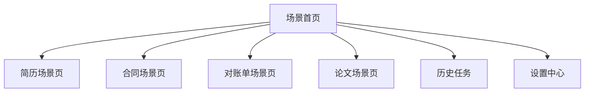
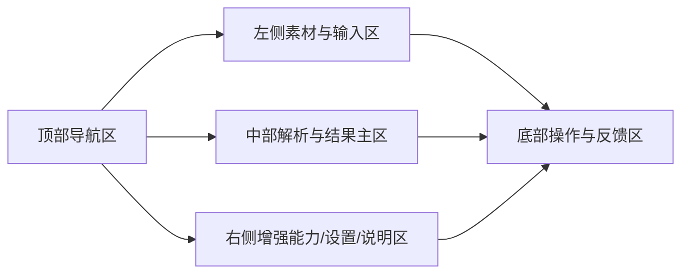
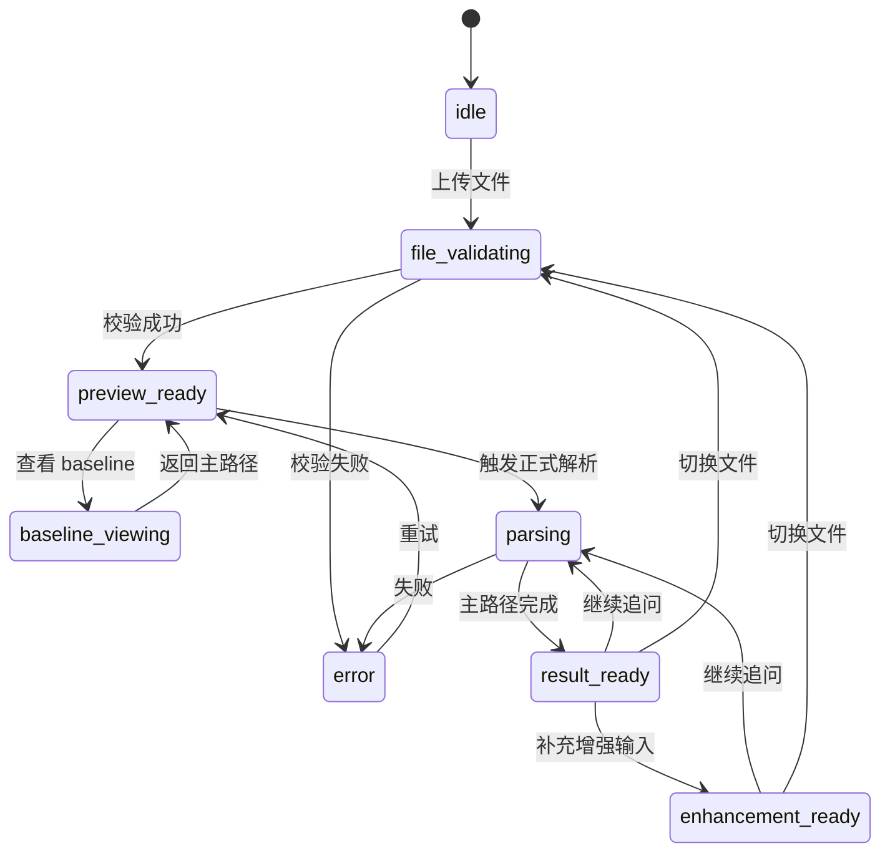

# SnapExtract 前端规格说明（Frontend Spec）

版本号：V2.0.0

| 版本 | 时间 | 修订人 | 备注 |
|------|------|--------|------|
| V1.0.0 | 2026/04/23 | Codex | 基于决赛版 PRD 抽取的前端专用执行规格 |
| V2.0.0 | 2026/05/06 | Codex | 面向正式产品前端重设计，改为场景首页 + 统一内核架构 |

## 1. 文档目标
本文件用于指导 SnapExtract 正式产品前端的重设计与实现，作为产品、设计、前端、后端协作时的统一规格文档。

本文件不再以比赛演示页为默认前提，而是定义一套可长期演进的产品前端规范，解决以下问题：
1. SnapExtract 正式前端应该采用什么样的信息架构。
2. 四个独立场景如何共享统一工作台骨架，同时保持任务边界清晰。
3. 主路径与增强模式如何在页面中表达，避免场景被错误串联。
4. 前端状态、组件边界、交互规则与验收标准如何定义。

## 2. 产品前端定位

### 2.1 定位
SnapExtract 前端是一个面向 AI PC 的高敏文档智能处理工作台。它通过统一的平台框架承载四个独立场景：
1. 简历
2. 合同
3. 对账单
4. 论文

前端的职责不是展示模型能力本身，而是把“上传材料、理解结果、完成判断、带走产物”组织成稳定、清晰、可连续使用的产品体验。

### 2.2 设计原则
1. 场景独立：四个场景各自成立，不通过统一主故事串联。
2. 平台一致：布局骨架、状态规则、提示系统、导出机制和视觉系统保持一致。
3. 主路径优先：优先让用户完成单文档主任务，再按需进入增强模式。
4. 桌面优先：以 AI PC 横向宽屏体验为主，移动端仅做基础降级。
5. 产品优先：演示态作为兼容模式存在，不主导整体 IA 和交互结构。

## 3. 适用范围与非目标

### 3.1 本文件覆盖
1. 场景选择首页
2. 四个独立场景页
3. 共享工作台骨架
4. 共享状态系统、提示系统、导出与追问机制
5. 演示兼容模式

### 3.2 本文件不覆盖
1. 模型推理与 NPU 优化细节
2. 后端任务编排的内部技术实现
3. 账号、权限、计费、组织体系等远期产品系统
4. 数据库存储结构与部署方案

## 4. 用户角色与使用目标

| 角色 | 使用场景 | 前端目标 |
|------|---------|---------|
| 办公/学习用户 | 上传单份材料并获得判断结果 | 快速进入场景，少步骤完成主任务 |
| 高敏知识工作者 | 处理不便上云的资料 | 在本地完成解析、判断、导出 |
| 演示操作者 | 现场切换样例、展示 baseline 与结果 | 流程稳定、切换清晰、少出错 |
| 评委/观看者 | 观看产品演示 | 快速理解每个场景解决什么问题、产出什么结果 |

## 5. 信息架构

### 5.1 一级 IA

### 5.2 IA 说明
1. 用户先进入场景首页，再选择一个场景进入工作台。
2. 四个场景页共享同一工作台骨架，但任务逻辑独立。
3. 历史任务和设置中心作为独立产品页存在，不与场景任务混写在一个页面中。

### 5.3 场景首页职责
1. 展示四个场景入口卡片。
2. 用一句话说明每个场景解决什么问题、产出什么结果。
3. 展示最近任务入口。
4. 展示推荐演示入口和样例入口。

## 6. 页面体系

### 6.1 页面列表
| 页面 | 目标 | 核心内容 |
|------|------|---------|
| 场景首页 | 建立入口认知 | 场景卡片、最近任务、推荐演示 |
| 简历场景页 | 完成候选人判断 | 简历上传、解析、评价、面试问题 |
| 合同场景页 | 完成签署判断 | 合同上传、风险识别、建议输出 |
| 对账单场景页 | 完成资金分析 | 流水上传、结构化、异常识别、验算 |
| 论文场景页 | 完成论文价值判断 | 目标论文解析、可选双论文对比 |
| 历史任务页 | 回看过往结果 | 任务列表、筛选、重开任务 |
| 设置中心 | 管理平台级偏好 | 输出语言、展示偏好、实验开关 |

### 6.2 四个场景页统一骨架

### 6.3 统一内核的含义
1. 布局骨架一致：四个场景页使用同一页面框架。
2. 视觉系统一致：色彩、排版、按钮层级、提示语义统一。
3. 状态机一致：场景切换、文件切换、解析、失败、增强模式接入采用同一规则。
4. 组件命名一致：公共组件名称和职责在四个场景中保持稳定。
5. 场景模块可替换：输入模块、判断模块、结果模块随场景替换。

## 7. 四个场景页规格

### 7.1 简历场景页

#### 主路径
上传简历 → 结构化解析 → 信息卡片 → 综合评价 → 面试问题

#### 页面目标
帮助用户快速判断候选人是否值得继续推进。

#### 必须模块
1. 简历上传与预览
2. 基础信息卡片
3. 经历与技能摘要
4. 综合评价
5. 面试问题

#### 输出结果
1. 信息卡片
2. 综合评价
3. 面试问题

### 7.2 合同场景页

#### 主路径
上传合同 → 关键信息提取 → 风险点识别 → 建议输出

#### 页面目标
帮助用户快速判断合同是否可签、哪些条款需要确认或修改。

#### 必须模块
1. 合同上传与预览
2. 关键信息提取
3. 风险点识别
4. 待确认事项
5. 建议输出

#### 输出结果
1. 信息提取
2. 风险点识别
3. 建议

### 7.3 对账单场景页

#### 主路径
上传银行对账单 → 结构化结果 → 异常识别 → 验算 → 分析

#### 增强模式
补传手写单据后，追加单据-流水比对、差异清单与映射视图。

#### 页面目标
帮助用户先完成银行对账单的单文档分析，再按需进入核对增强模式。

#### 输入规则
1. 银行对账单是主输入。
2. 手写单据不是前置必填。
3. 未补传手写单据时，主路径仍然完整成立。

#### 输出结果
1. 银行对账单结构化结果
2. 异常识别结果
3. 验算结果
4. 分析结果
5. 增强模式下追加比对结果与差异清单

### 7.4 论文场景页

#### 主路径
上传目标论文 → 研究问题/方法/结果/参考价值解析

#### 增强模式
补传用户论文后，追加双论文对比。

#### 页面目标
帮助用户先完成目标论文的单文档判断，再按需进入双论文对比。

#### 输入规则
1. 目标论文是主输入。
2. 用户论文不是前置必填。
3. 未补传用户论文时，主路径仍然完整成立。

#### 输出结果
1. 目标论文解析结果
2. 研究问题
3. 使用方法
4. 核心结果
5. 参考价值
6. 增强模式下追加相似点、差异点、可借鉴点、对用户论文的作用

## 8. 全局状态模型

### 8.1 UI 状态定义
| 状态 | 说明 | 页面表现 |
|------|------|---------|
| idle | 初始待机 | 展示空状态与场景说明 |
| file_validating | 文件校验中 | 上传区显示处理中 |
| preview_ready | 预览已就绪 | 主路径可启动 |
| baseline_viewing | 查看 baseline 对照结果 | 单独展示 baseline，不与正式结果混排 |
| parsing | 正式解析中 | 提交区禁用，结果区显示进行中 |
| result_ready | 主路径结果完成 | 展示当前场景结果与导出入口 |
| enhancement_ready | 增强模式结果完成 | 在主路径结果基础上追加增强结果 |
| error | 当前任务失败 | 展示错误提示与恢复路径 |

### 8.2 状态切换规则
1. 场景切换：
   - 清空当前任务上下文
   - 不继承上一个场景的文件、结果、追问和提醒
2. 文件切换：
   - 生成新的 `task_id`
   - 立即清空旧结果与旧增强态
3. baseline 接入：
   - baseline 是单独展示态
   - 不覆盖正式解析结果
   - 不与正式解析任务串台
4. 增强输入接入：
   - 不覆盖主路径结果
   - 在当前场景内追加增强态
5. 失败回退：
   - 保留原文件预览
   - 不保留半成品强结论
   - 允许重试或退回主路径

### 8.3 状态图

## 9. 组件体系与命名规范

### 9.1 组件层级
1. `PageShell`：统一页面容器
2. `ScenarioHero` / `ScenarioHeader`：场景头部信息
3. `UploadPanel`：上传与文件校验
4. `PreviewPanel`：预览与元信息
5. `TaskPanel`：主路径输入与提交
6. `ResultPanel`：结果主区
7. `EnhancementPanel`：增强模式输入与结果
8. `StatusBanner`：状态提示与边界提醒
9. `ActionBar`：复制、导出、重试、返回等操作

### 9.2 命名约束
1. 公共骨架组件以平台职责命名，不以场景命名。
2. 场景专属模块采用 `Resume*`、`Contract*`、`Statement*`、`Paper*` 前缀命名。
3. 不允许把主路径组件和增强模式组件混写在同一职责组件中。

### 9.3 前后端最小数据契约
| 字段 | 类型 | 说明 |
|------|------|------|
| task_id | String | 当前任务唯一标识 |
| scenario_type | Enum | 当前场景类型 |
| file_type | Enum | 文件类型 |
| status | Enum | 当前任务状态 |
| baseline_mode | Boolean | 是否在 baseline 查看态 |
| enhancement_mode | Boolean | 是否进入增强模式 |
| result_text | Text | 结果文本 |
| result_blocks | Array | 结构化结果块 |
| confidence_level | Enum | 结果置信度 |
| error_code | String | 错误码 |
| error_message | String | 错误提示 |

## 10. 交互规则与边界提示

### 10.1 红黄提醒机制
| 类型 | 触发条件 | 系统行为 |
|------|---------|---------|
| 红色提醒 | 缺硬条件字段，无法支撑关键判断 | 阻断强结论，明确指出缺失字段 |
| 黄色提醒 | 字段存在但证据弱、语义弱 | 允许继续输出，但结论降级为倾向性判断 |

### 10.2 页面交互约束
1. 未上传有效文件时，不允许启动正式解析。
2. 请求中禁止重复提交。
3. 新任务开始时，旧结果必须立即清空。
4. 增强输入接入后，主路径结果仍需保持可见。
5. 低置信度结果必须显式提示，不得伪装成稳定结果。

### 10.3 baseline 展示规则
1. baseline 仅承担演示对照角色。
2. baseline 不参与正式结果计算。
3. baseline 展示态必须可随时退出并返回主路径。

## 11. 响应式与终端适配策略

### 11.1 默认目标
桌面优先，面向 AI PC 横向宽屏设计。

### 11.2 适配策略
1. 桌面端：
   - 完整展示三栏或四区工作台结构
   - 主结果区优先获得最大可视面积
2. 平板与中等宽度：
   - 允许右侧辅助区折叠为抽屉或标签页
   - 保持主路径完整可用
3. 手机与窄屏：
   - 只保证主流程可读、可操作
   - 不承诺复杂工作台交互的完整体验

## 12. 演示兼容模式

### 12.1 目标
在不改变正式 IA 的前提下，为答辩和演示提供更可控的操作模式。

### 12.2 兼容能力
1. 场景首页可提供推荐演示入口。
2. 场景页可提供预置样例加载。
3. baseline 对照展示可保留。
4. 演示提示、环境状态、异常兜底提示可保留。

### 12.3 不应做的事情
1. 不因演示态重新把四个场景串成统一主故事。
2. 不因演示态把增强模式写成所有用户都必须经历的主流程。
3. 不让演示专用交互污染正式产品 IA。

## 13. 验收标准

| 项目 | 验收标准 | 优先级 |
|------|---------|--------|
| IA 结构 | 明确形成“场景首页 + 四个独立场景页 + 二级产品页”的结构 | P0 |
| 独立场景 | 四个场景各自输入、各自判断、各自输出，不依赖统一主故事 | P0 |
| 统一骨架 | 四个场景页共享页面骨架、状态规则与组件命名 | P0 |
| 对账单主路径 | 银行对账单单独可完成结构化、异常识别、验算、分析 | P0 |
| 对账单增强态 | 补传手写单据后可追加比对与差异清单，不影响主路径成立 | P0 |
| 论文主路径 | 目标论文单独可完成研究问题、方法、结果和参考价值解析 | P0 |
| 论文增强态 | 补传用户论文后可追加双论文对比，不影响主路径成立 | P0 |
| 状态规则 | 完整覆盖场景切换、文件切换、baseline、正式解析、增强模式、失败回退 | P0 |
| 可设计性 | 设计师可直接按文档产出首页与四个场景页线框 | P1 |
| 可实现性 | 前端工程师可直接按页面、组件、状态模型拆分实现 | P1 |

## 14. 默认假设
1. 本规格面向正式 Web 前端重设计，不以 Gradio 为默认技术前提。
2. 场景首页 + 统一内核是当前默认 IA 方案。
3. 四个场景保持独立，不再通过统一主故事串联。
4. 桌面 AI PC 是主目标终端，移动端仅做基础降级适配。
5. 演示态只作为兼容模式存在，不主导正式产品结构。
