# SnapExtract 产品需求文档（PRD）

版本号：V1.0.0

| 版本 | 时间 | 修订人 | 备注 |
|------|------|--------|------|
| V1.0.0 | 2026/04/23 | Codex | 基于复赛会议纪要、演示文稿与演示视频整理决赛优化版 PRD |

## 一、概述（为什么做）

### 1.1 产品概述及目标

#### 1.1.1 背景介绍
SnapExtract 当前已完成可演示 Demo，具备图片、PDF、公式、流程图、表格五类视觉内容的上传、理解与问答能力，并已接入骁龙端侧 NPU 推理链路。复赛沟通会明确指出，该项目已具备“可展示”的基础，但距离“可信、稳定、足够打动评委”的决赛形态仍存在明显短板。

当前主要问题集中在五个方面：
1. 输出语言一致性不足，存在中文输入返回英文的情况。
2. OCR 与多格式素材处理稳定性不足，纯图 PDF 能力未充分验证。
3. 前端体验粗糙，页面结构简单，状态展示弱，无法支撑高质量现场演示。
4. 缺少设置菜单，模型、提示词、输出格式等关键参数不可配置。
5. 演示保障能力不足，存在历史预览残留、端口冲突风险、标准样例与测试样本不足等问题。

决赛阶段的核心目标不是扩展更多长期功能，而是围绕现有技术路线，完成一轮围绕“可演示、可解释、可复现、可评审”的产品整改，使 SnapExtract 从“功能跑通”升级为“产品体验完整、评委可感知价值明确”的端侧 AI Demo。

#### 1.1.2 产品概述
SnapExtract 是一款基于骁龙端侧 NPU 的多模态视觉信息理解 Demo，帮助办公与学习用户对图片、PDF、公式、流程图、表格进行上传、理解、抽取与问答。产品以 Windows on ARM 本地部署为基础，强调离线可用、隐私安全、低时延和多类型视觉内容的统一理解能力。

本次决赛优化版以现有 Demo 为基础，面向评委演示场景与真实办公学习场景，对交互、稳定性、控制能力和演示可信度进行系统升级。

#### 1.1.3 产品目标

**业务目标**

| 目标 | 指标 | 目标值 | 达成时间 |
|------|------|--------|---------|
| 提升决赛演示完成度 | 决赛核心场景演示成功率 | >= 95% | 决赛前 |
| 提升评委感知完整度 | 单次演示覆盖核心能力数 | >= 5 类视觉内容 | 决赛前 |
| 提升产品说服力 | 标准样例集覆盖率 | 100% 覆盖图片、PDF、公式、流程图、表格 | 决赛前 |
| 提升结果一致性 | 输入输出语言匹配率 | >= 95% [待确认：需以标准测试集复核] | 决赛前 |

**用户目标**

| 目标用户 | 用户目标 | 衡量指标 |
|---------|---------|---------|
| 评委/演示观看者 | 在短时间内理解产品价值与端侧 AI 差异化能力 | 2 分钟内完成“上传-提问-结果输出”闭环演示 |
| 办公/学习用户 | 对常见视觉文档进行快速理解与问答 | 单轮任务从上传到首个可读结果输出时间可控且过程可见 |
| 演示操作者 | 在现场稳定切换样例、控制输出语言与格式、快速恢复异常 | 关键操作不超过 2 步，异常可在 30 秒内恢复 [待确认] |

#### 1.1.4 目标用户

| 角色 | 描述 | 核心诉求 |
|------|------|---------|
| 评委/演示观看者 | 在比赛现场观看产品演示的评审人员 | 快速看懂产品价值、差异化与完整性 |
| 办公用户 | 处理扫描件、图表、PDF、表格等资料的知识工作者 | 快速抽取重点、减少手工整理与查找成本 |
| 学习用户 | 处理教材截图、公式图、流程图、课堂材料的学生或教师 | 快速理解内容、生成摘要、整理复习要点 |
| 演示操作者 | 决赛现场负责操作产品的团队成员 | 快速切换素材、控制演示节奏、避免出错 |

### 1.2 名词说明

| 名词 | 说明 |
|------|------|
| WoA | Windows on ARM，运行于 ARM 架构设备上的 Windows 环境 |
| NPU | Neural Processing Unit，神经网络处理单元 |
| OCR | 光学字符识别，用于从图像中提取文字 |
| 纯图 PDF | 页面内容以图片为主、缺少可直接复制文本层的 PDF |
| 标准样例库 | 赛前用于演示、回归测试、答辩说明的固定素材集合 |
| 演示模式 | 面向比赛现场的轻量操作模式，强调稳定、可控、少步骤 |
| 流式输出 | 模型在推理过程中分段返回答案，而非一次性完整返回 |

### 1.3 角色及权限

| 角色 | 权限范围 | 数据范围 |
|------|---------|---------|
| 演示操作者 | 上传文件、选择样例、发起解析、调整设置、导出结果、查看状态提示 | 当前本机会话数据 |
| 普通使用者 | 上传文件、提问、查看结果、复制导出 | 当前本机会话数据 |
| 系统维护者 | 调整模型配置、提示词模板、默认参数、样例素材配置、环境诊断 | 本机全部配置与日志 [待确认] |

### 1.4 文档阅读对象

| 对象 | 关注内容 |
|------|---------|
| 产品 | 范围边界、版本目标、功能优先级、评审价值点 |
| 研发 | 功能定义、状态流转、异常处理、配置能力、日志与启动自检 |
| UI/UX | 页面信息架构、全局交互、状态反馈、演示模式交互约束 |
| 测试 | 核心场景、标准样例库、异常流程、验收标准 |
| 比赛答辩成员 | 产品定位、差异化价值、演示顺序、风险兜底说明 |

## 二、产品描述（做什么）

### 2.1 产品需求描述
本次需求聚焦两个连续阶段：
1. 决赛前必须交付的产品优化能力，保持现有技术路线不变，即“端侧本地推理 + 骁龙 NPU + 现有模型路线”，以 Gradio 作为比赛阶段展示层。
2. 决赛后面向产品化落地的前端重构准备，明确 Gradio 仅作为比赛 Demo 壳层，后续需演进到正式 Web 产品前端架构。

本次优化范围包括：
1. 重构上传、预览、提问、结果展示的主界面信息结构。
2. 增强多模态解析链路的文件识别、预处理、稳定性提示与失败反馈。
3. 新增设置中心，使演示过程中可控制模型、提示词、输出语言、输出格式与回答风格。
4. 新增演示保障能力，包括推荐样例、启动自检、端口冲突提示、异常兜底与标准用例。
5. 固化核心状态规则，解决历史预览残留、任务串台、结果区状态不清的问题。
6. 明确前端重构边界：当前阶段仅在 Gradio 内做结构重组与视觉升级，不在决赛前深做复杂产品能力。
7. 新增产品化迁移方案：赛后将前端重构为正式 Web 技术栈，并与模型推理层、业务层解耦。

本次明确不做：
1. 不新增账号注册登录。
2. 不新增云端存储或云边协同推理。
3. 不扩展到企业管理后台。
4. 不将“实验性能力”包装为稳定承诺，纯图 PDF 等未充分验证能力需明确标注。
5. 不在决赛前将 Gradio Demo 直接重写为正式产品前端，避免影响比赛交付。

### 2.2 产品整体流程

#### 2.2.1 主流程

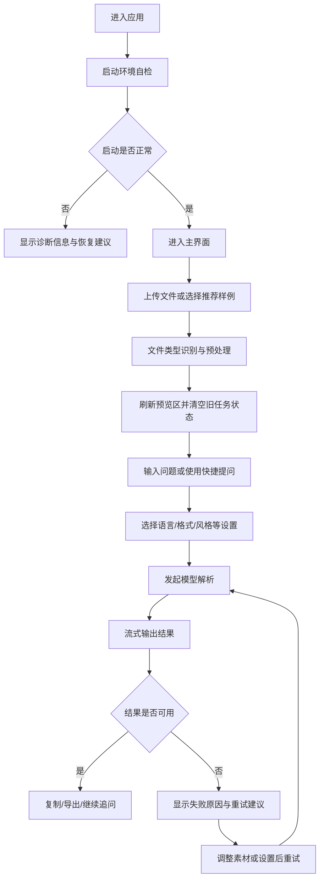

#### 2.2.2 子流程

子流程一：上传与预览刷新流程

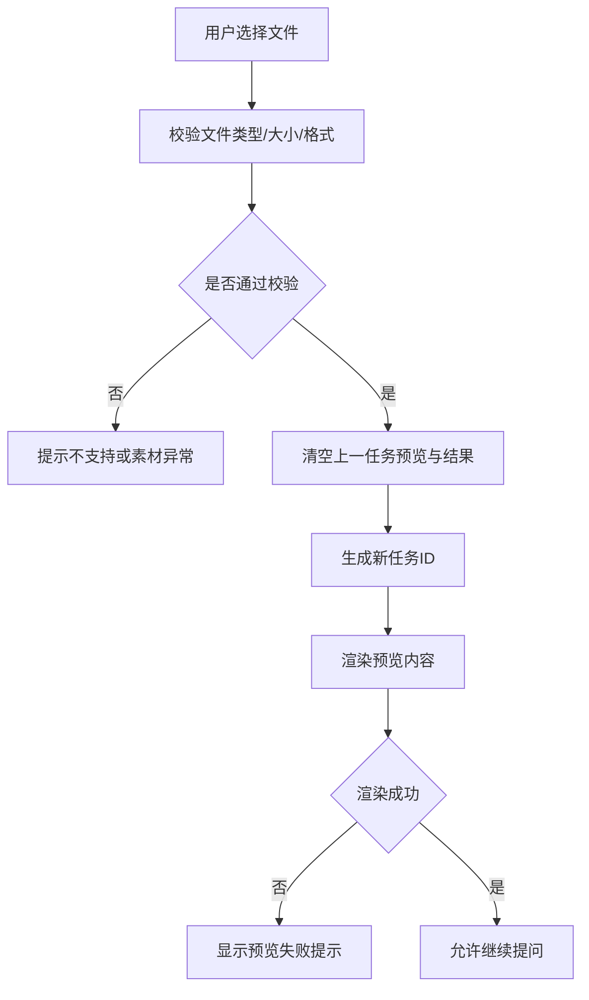

子流程二：结果语言控制流程

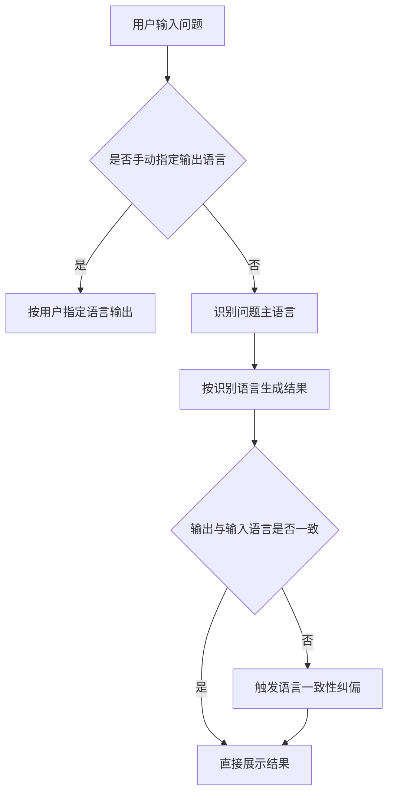

#### 2.2.3 数据流图（DFD）

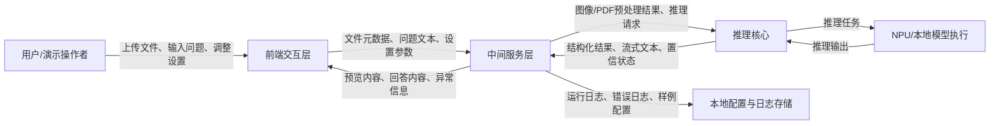

#### 2.2.4 状态转换图（STD）

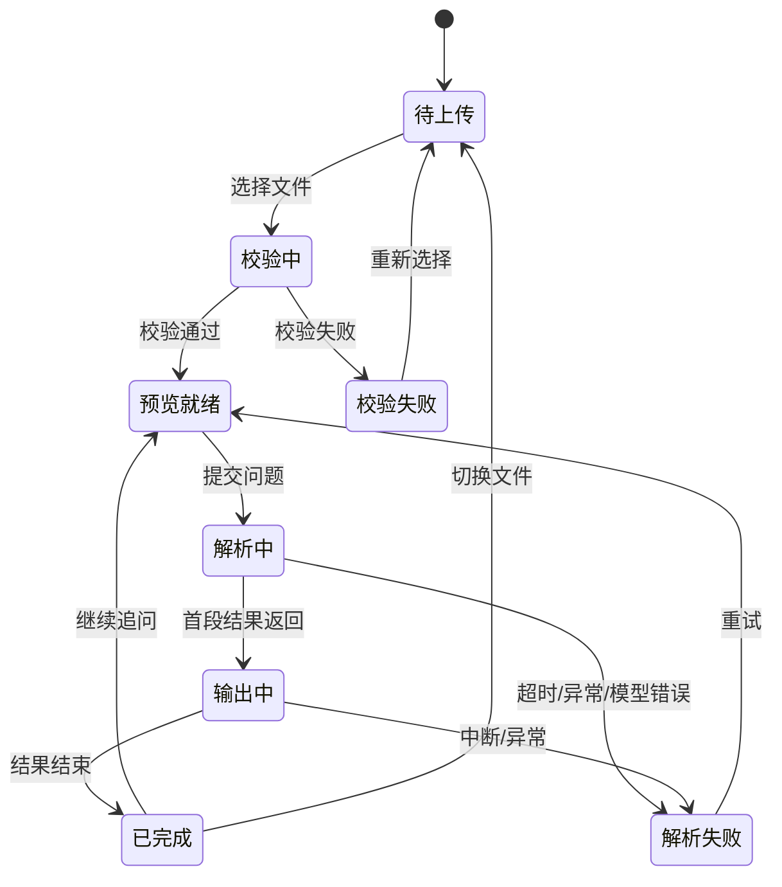

### 2.3 全局说明

#### 2.3.1 全局异常处理

| 异常场景 | 处理方式 | 提示文案 |
|---------|---------|---------|
| 文件格式不支持 | 阻止进入解析流程，提示支持格式与建议素材类型 | “当前仅支持图片、PDF、公式图、流程图、表格类素材，请更换文件后重试。” |
| 文件过大或清晰度过低 | 阻止或提示风险，给出压缩/替换建议 | “素材质量不足，可能影响识别效果，建议更换更清晰文件。” |
| 预览生成失败 | 允许重新上传，清空旧状态，不保留旧结果 | “预览生成失败，请重新上传或切换样例。” |
| 模型响应超时 | 展示超时信息，提供一键重试与简化提问建议 | “本次解析超时，请重试或缩小问题范围。” |
| 输出语言不一致 | 自动纠偏一次，仍失败则提示用户手动切换语言 | “系统已尝试按输入语言纠偏，建议在设置中手动指定输出语言。” |
| 纯图 PDF 低置信度 | 返回低置信度提醒，而非伪装为稳定结果 | “该 PDF 可能为图片型文档，当前识别置信度较低，建议使用更清晰版本。” |
| 端口冲突或环境异常 | 启动阶段阻断进入主界面，展示恢复建议 | “检测到服务端口冲突，请按提示切换端口或重新启动应用。” |
| 系统异常 | 展示错误码，记录本地日志，保留当前文件信息 [待确认] | “系统出现异常，请稍后重试或联系维护人员。” |

#### 2.3.2 普通列表规则
本产品不引入后台管理列表。标准样例库与历史结果如需展示，采用轻量卡片或样例面板，不设计复杂分页列表。

| 规则项 | 说明 |
|--------|------|
| 标准样例展示 | 默认展示 5 类推荐样例，每类至少 1 个 |
| 排序 | 推荐样例按演示优先级排序 |
| 空状态 | 未配置样例时显示“暂无推荐样例，请手动上传” |
| 批量操作 | 不支持批量上传或批量任务处理 |
| 历史记录 | 本版不做持久化历史记录，仅保留当前会话 [假设] |

#### 2.3.3 全局交互

| 场景 | 交互方式 |
|------|---------|
| 文件切换 | 强制清空旧预览、旧结果、旧任务状态，重新生成任务 ID |
| 提交问题 | 按钮进入 loading 态，禁止重复提交 |
| 流式输出 | 优先展示逐段返回内容，并显示当前解析状态 |
| 操作成功 | Toast 提示“已完成”或“已保存设置” |
| 操作失败 | 在结果区内直接显示可读错误与恢复建议 |
| 空状态 | 区分“未上传”“未提问”“解析失败后待重试”三种状态 |
| 设置变更 | 新设置仅对新任务生效，不回写当前已完成结果 |
| 演示模式 | 提供一键加载推荐样例与快捷问题入口 |
| 前端演进 | 决赛版页面结构与状态设计需尽量向正式产品信息架构靠拢，减少后续重构返工 |

### 2.4 产品版本规划（里程碑）

| 版本 | 范围 | 计划时间 | 状态 |
|------|------|---------|------|
| V1.0 | 决赛必交付：界面重构、设置中心、语言控制、预览刷新、异常兜底、标准样例库 | 决赛前 | 规划中 |
| V1.1 | 决赛后增强：更多导出能力、更多样例管理能力、纯图 PDF 能力验证增强 | 决赛后 | 待规划 |
| V2.0 | 产品化重构：正式前端重写、业务后端补齐、任务与配置体系解耦、产品工作台上线 | [待确认：赛后排期] | 远期规划 |

### 2.5 产品框架
当前比赛版产品整体分为六个一级模块：
1. 上传与预览区：负责文件导入、类型校验、预览渲染、清空旧状态。
2. 问题输入区：负责提问输入、快捷问题、提交控制。
3. 结果输出区：负责流式输出、结果展示、复制/导出、错误提示。
4. 设置中心：负责模型、提示词、语言、格式、风格等配置项管理。
5. 演示模式区：负责推荐样例、标准问题、演示路径控制。
6. 运行保障区：负责启动自检、端口检查、日志记录、恢复建议。

产品化目标架构分为三层：
1. 前端产品层：基于正式 Web 技术栈承载工作台、设置、历史任务、产品导航与权限入口。
2. 业务服务层：承载任务管理、文件管理、配置管理、日志审计、样例管理、导出与用户体系。
3. AI 能力层：承载 OCR、PDF 渲染、视觉理解、模型路由、推理执行与结果后处理。

#### 产品框架图

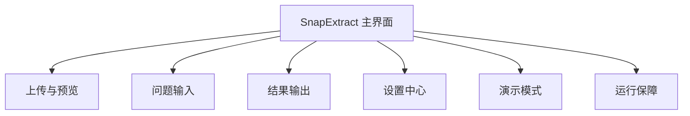

#### 产品化目标架构图

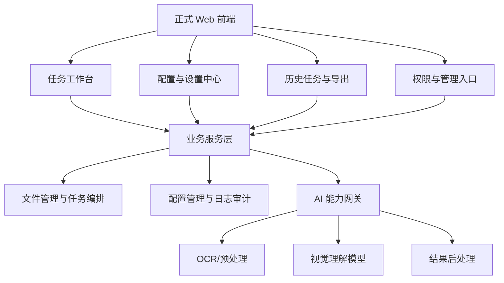

### 2.6 功能清单

| 模块 | 功能 | 优先级 | 版本 | 说明 |
|------|------|--------|------|------|
| 上传与预览 | 文件上传 | P0 | V1.0 | 支持图片与 PDF 等现有素材类型 |
| 上传与预览 | 文件识别与校验 | P0 | V1.0 | 校验类型、大小、基础清晰度 [待确认：阈值] |
| 上传与预览 | 预览刷新与清空旧状态 | P0 | V1.0 | 解决历史图片残留问题 |
| 多模态解析 | 图片理解 | P0 | V1.0 | 支持对象、场景与问题回答 |
| 多模态解析 | PDF 理解 | P0 | V1.0 | 支持摘要、问答、重点抽取 |
| 多模态解析 | 公式识别 | P0 | V1.0 | 输出可编辑公式格式 |
| 多模态解析 | 流程图理解 | P0 | V1.0 | 识别节点并概括逻辑 |
| 多模态解析 | 表格问答 | P0 | V1.0 | 精准定位字段并回答 |
| 多模态解析 | 纯图 PDF 识别提示 | P1 | V1.0 | 实验性支持，低置信度需提示 |
| 结果输出 | 流式输出 | P0 | V1.0 | 显示推理过程中的增量结果 |
| 结果输出 | 输出语言控制 | P0 | V1.0 | 自动跟随输入语言或手动指定 |
| 结果输出 | 输出格式控制 | P1 | V1.0 | 纯文本、Markdown、LaTeX [待确认] |
| 结果输出 | 复制/导出 | P1 | V1.0 | 复制结果，导出能力范围待确认 |
| 设置中心 | 模型选择 | P1 | V1.0 | 基于现有模型路线提供可配置入口 |
| 设置中心 | 提示词模板 | P1 | V1.0 | 支持预置模板与自定义编辑 [待确认] |
| 设置中心 | 回答风格 | P1 | V1.0 | 简洁、详细、结构化等风格选项 |
| 演示模式 | 推荐样例一键加载 | P0 | V1.0 | 支持五类样例直达 |
| 演示模式 | 标准问题快捷入口 | P1 | V1.0 | 降低现场手打成本 |
| 运行保障 | 启动自检 | P0 | V1.0 | 检查端口、模型、依赖状态 |
| 运行保障 | 端口冲突提示 | P0 | V1.0 | 避免前后端端口冲突影响演示 |
| 运行保障 | 错误日志与恢复建议 | P1 | V1.0 | 面向演示操作者的可读诊断 |
| 前端重构规划 | 比赛版 Gradio 增强边界 | P0 | V1.0 | 明确只做结构与状态升级，不深做长期产品能力 |
| 前端重构规划 | 正式前端技术栈重构 | P1 | V2.0 | 赛后重写为正式 Web 前端 |
| 前端重构规划 | 前后端能力解耦 | P1 | V2.0 | 页面层不再直接绑定模型推理逻辑 |

## 三、功能需求（怎么做）

### 3.1 上传与预览

#### 3.1.1 描述
负责文件导入、素材类型识别、预览渲染以及文件切换时的旧状态清理，是所有解析任务的统一入口。

#### 3.1.2 用户故事
作为演示操作者，我希望快速上传一份素材并立即看到正确预览，以便顺畅开始现场演示。

作为办公或学习用户，我希望系统在上传时就告诉我素材是否可解析，以便避免无效等待。

#### 3.1.3 前置条件

| 类型 | 条件 |
|------|------|
| 环境依赖 | 应用已完成启动自检并进入可用状态 |
| 数据依赖 | 用户准备好图片、PDF、公式图、流程图或表格素材 |
| 功能依赖 | 无 |

#### 3.1.4 后置条件
1. 成功上传后生成新的任务 ID。
2. 预览区展示当前文件内容。
3. 旧任务结果与旧预览被清空。
4. 当前任务进入“预览就绪”状态。

#### 3.1.5 界面及交互

| 元素 | 类型 | 必填 | 默认值 | 校验规则 | 操作反馈 |
|------|------|------|--------|---------|---------|
| 上传按钮 | 按钮 | 是 | - | 点击后打开文件选择器 | 成功后展示文件名与文件信息 |
| 拖拽上传区 | 拖拽容器 | 否 | 空状态插画 | 仅接受支持类型 | 拖入时高亮，释放后开始校验 |
| 文件名显示 | 文本 | 是 | - | 长文件名省略显示 | Hover 显示全名 |
| 文件类型标签 | 标签 | 是 | 自动识别 | 基于扩展名与内容识别 | 显示图片/PDF/流程图等标签 |
| 预览区 | 预览容器 | 是 | 空状态 | 文件切换时必须刷新 | 失败时显示可重试提示 |
| 清空按钮 | 按钮 | 否 | 隐藏 | 上传后可见 | 清空当前任务相关状态 |

#### 3.1.6 业务流程

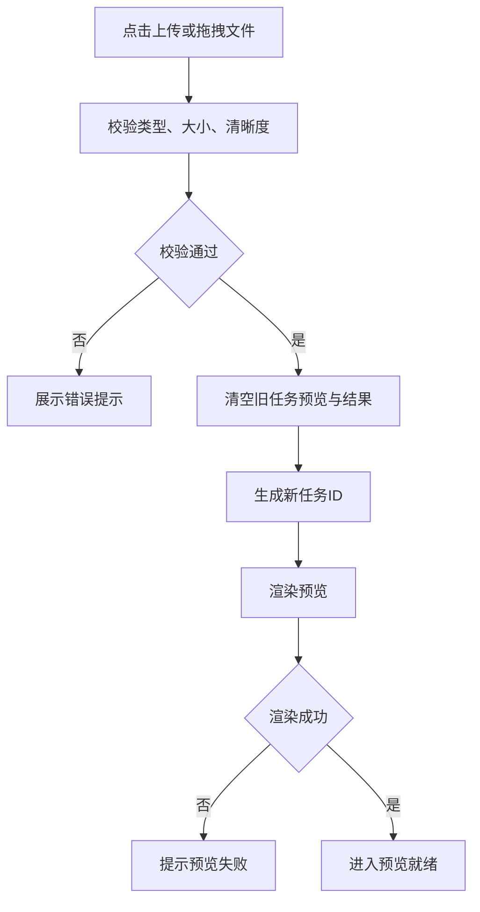

#### 3.1.7 异常/分支流程

| 场景 | 触发条件 | 处理方式 | 提示文案 |
|------|---------|---------|---------|
| 文件不支持 | 上传非支持类型 | 阻止提交 | “当前文件类型暂不支持。” |
| 素材质量不足 | 清晰度过低或页面损坏 | 允许继续但提示风险，或阻断 [待确认] | “素材质量可能影响识别效果。” |
| 历史内容残留 | 用户切换文件 | 强制清空预览与结果区 | 不单独提示 |
| 预览生成失败 | 渲染异常 | 显示重试按钮 | “预览生成失败，请重新上传。” |

#### 3.1.8 数据字典

| 字段名 | 类型 | 必填 | 说明 | 示例值 |
|--------|------|------|------|--------|
| task_id | String | 是 | 当前解析任务唯一标识 | task_20260423_001 |
| file_name | String(255) | 是 | 上传文件名 | 学术论文.pdf |
| file_type | Enum | 是 | 素材类型 | pdf |
| file_size | Long | 是 | 文件大小，单位 byte | 338500 |
| preview_status | Enum | 是 | 预览状态：pending/ready/failed | ready |
| quality_flag | Enum | 否 | 素材质量标识：normal/low/unsupported | low |

### 3.2 多模态解析

#### 3.2.1 描述
负责对图片、PDF、公式、流程图、表格等素材进行解析，并依据问题生成针对性回答。

#### 3.2.2 用户故事
作为普通用户，我希望系统不仅识别文字，还能理解视觉内容并回答具体问题，以便减少人工阅读和整理成本。

作为评委，我希望在多种素材类型上看到统一且准确的理解能力，以便确认产品的综合价值。

#### 3.2.3 前置条件

| 类型 | 条件 |
|------|------|
| 数据依赖 | 已存在有效任务且预览状态为 ready |
| 权限依赖 | 无 |
| 功能依赖 | 需先完成 3.1 上传与预览 |

#### 3.2.4 后置条件
1. 任务进入解析中、输出中、已完成或解析失败状态之一。
2. 结果区展示结构化文本结果。
3. 若低置信度，返回提示而非静默失败。

#### 3.2.5 界面及交互

| 元素 | 类型 | 必填 | 默认值 | 校验规则 | 操作反馈 |
|------|------|------|--------|---------|---------|
| 提问输入框 | 多行文本框 | 是 | “例如：概括这个 PDF / 这张图里有什么？” | 字数上限 [待确认] | 超长时提示 |
| 快捷问题区 | 快捷按钮 | 否 | 按素材类型推荐 | 根据素材类型展示不同模板 | 点击后自动填充问题 |
| 提交按钮 | 按钮 | 是 | 可点击 | 解析中禁用 | 进入 loading 态 |
| 解析状态标签 | 标签 | 是 | 待解析 | 随状态切换 | 展示“解析中/输出中/已完成/失败” |
| 置信度提示 | 提示条 | 否 | 隐藏 | 低置信度时展示 | 提示用户结果存在风险 |

#### 3.2.6 业务流程

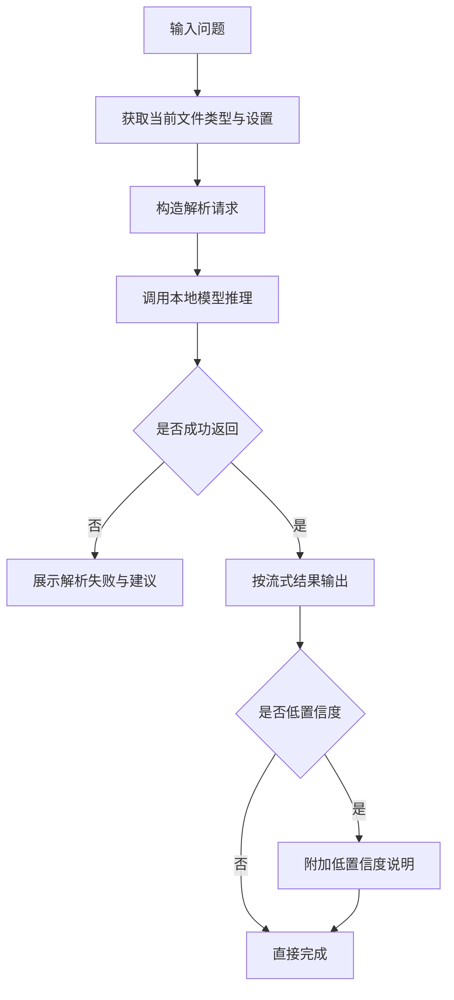

#### 3.2.7 异常/分支流程

| 场景 | 触发条件 | 处理方式 | 提示文案 |
|------|---------|---------|---------|
| 模型超时 | 超过阈值未返回 | 中断当前任务并提示重试 | “解析超时，请重试或简化问题。” |
| 纯图 PDF 能力不足 | 文本层缺失且 OCR 置信度低 | 给出实验性支持提示 | “当前为图片型 PDF，识别结果仅供参考。” |
| 流程图结构复杂 | 节点过多或图像质量差 | 优先概括主线，提示细节可能缺失 | “流程主线已提取，部分细节可能缺失。” |
| 表格字段模糊 | 单元格识别不稳定 | 返回模糊提示并建议重新提问 | “未能稳定定位目标字段，请更明确描述目标行列。” |

#### 3.2.8 数据字典

| 字段名 | 类型 | 必填 | 说明 | 示例值 |
|--------|------|------|------|--------|
| question_text | String(2000) | 是 | 用户输入问题 | 概括这个 PDF 的重点 |
| parse_mode | Enum | 是 | 解析模式 | pdf_summary |
| confidence_level | Enum | 否 | 结果置信度 | medium |
| parse_status | Enum | 是 | parsing/streaming/success/failed | streaming |
| error_code | String | 否 | 失败错误码 | TIMEOUT |
| error_message | String | 否 | 失败提示文案 | 解析超时 |

### 3.3 结果输出

#### 3.3.1 描述
负责结果内容展示、语言控制、输出格式切换以及复制导出等后续操作，是评委感知产品能力的核心区域。

#### 3.3.2 用户故事
作为演示操作者，我希望输出结果语言稳定、结构清晰、可复制，以便现场展示时更专业。

作为普通用户，我希望可以按我的阅读习惯控制输出格式，以便后续整理内容。

#### 3.3.3 前置条件

| 类型 | 条件 |
|------|------|
| 数据依赖 | 已完成一次有效解析请求 |
| 权限依赖 | 无 |
| 功能依赖 | 需先完成 3.2 多模态解析 |

#### 3.3.4 后置条件
1. 用户看到完整或增量结果。
2. 用户可执行复制与导出。
3. 当前结果与当前任务绑定，不得串到其他任务。

#### 3.3.5 界面及交互

| 元素 | 类型 | 必填 | 默认值 | 校验规则 | 操作反馈 |
|------|------|------|--------|---------|---------|
| 结果面板 | 内容容器 | 是 | 空状态提示 | 仅展示当前任务结果 | 输出中显示增量内容 |
| 语言选择器 | 下拉/单选 | 否 | 跟随输入语言 | 手动设置优先于自动 | 新任务生效 |
| 格式选择器 | 下拉/分段控件 | 否 | 纯文本 [假设] | 仅支持已接入格式 | 切换后重新格式化显示 |
| 复制按钮 | 按钮 | 否 | 隐藏 | 有结果时可用 | 成功后 Toast 提示 |
| 导出按钮 | 按钮 | 否 | 隐藏 | 导出范围 [待确认] | 导出成功后提示路径或文件名 |

#### 3.3.6 业务流程

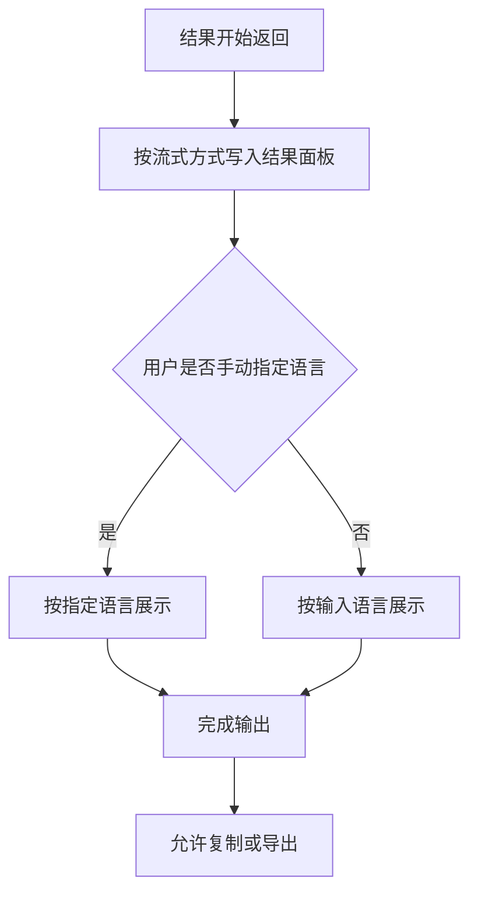

#### 3.3.7 异常/分支流程

| 场景 | 触发条件 | 处理方式 | 提示文案 |
|------|---------|---------|---------|
| 输出语言不一致 | 自动跟随失败 | 自动纠偏一次，失败则提示手动设置 | “请在设置中指定输出语言后重试。” |
| 输出被中断 | 流式输出异常终止 | 标记为失败，不展示“已完成”状态 | “结果输出中断，请重试。” |
| 导出失败 | 路径不可写或格式异常 | 提示复制替代方案 | “导出失败，建议先复制结果内容。” |

#### 3.3.8 数据字典

| 字段名 | 类型 | 必填 | 说明 | 示例值 |
|--------|------|------|------|--------|
| output_language | Enum | 是 | zh/en/auto | zh |
| output_format | Enum | 是 | text/markdown/latex | markdown |
| stream_enabled | Boolean | 是 | 是否启用流式输出 | true |
| result_text | Text | 否 | 结果主体内容 | 本文主要讨论…… |
| export_type | Enum | 否 | 复制或导出格式 | text |

### 3.4 设置中心

#### 3.4.1 描述
用于统一管理模型、提示词、语言、输出格式和回答风格等参数，解决当前 Demo 缺少配置入口的问题。

#### 3.4.2 用户故事
作为演示操作者，我希望在不修改代码的情况下调整关键参数，以便针对不同素材或评委提问快速切换策略。

#### 3.4.3 前置条件

| 类型 | 条件 |
|------|------|
| 数据依赖 | 应用已正常启动 |
| 权限依赖 | 普通使用者可见基础设置，维护者可见高级设置 [待确认] |
| 功能依赖 | 无 |

#### 3.4.4 后置条件
1. 新配置保存到当前会话或本地配置文件 [待确认]。
2. 新任务使用最新设置。
3. 当前已完成结果不受影响。

#### 3.4.5 界面及交互

| 元素 | 类型 | 必填 | 默认值 | 校验规则 | 操作反馈 |
|------|------|------|--------|---------|---------|
| 模型选择 | 下拉 | 否 | 默认模型 | 仅展示已配置模型 | 保存后提示“新任务生效” |
| 提示词模板 | 下拉/编辑框 | 否 | 默认模板 | 模板长度上限 [待确认] | 保存后预览模板摘要 |
| 输出语言 | 单选/下拉 | 否 | auto | zh/en/auto | 影响新任务结果语言 |
| 输出格式 | 单选/下拉 | 否 | text | 仅支持已接入格式 | 影响新任务展示 |
| 回答风格 | 单选 | 否 | 简洁 | 简洁/详细/结构化 [假设] | 立即更新当前设置说明 |
| 恢复默认 | 按钮 | 否 | - | 需二次确认 | 恢复后 Toast 提示 |

#### 3.4.6 业务流程

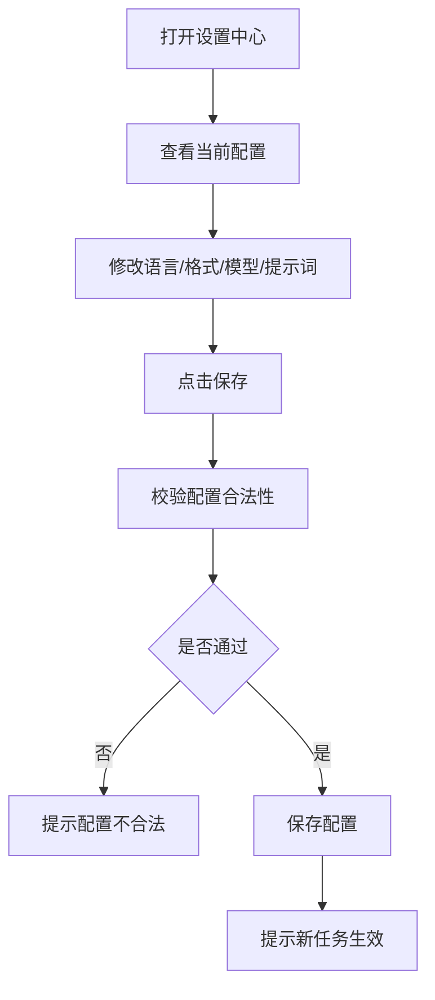

#### 3.4.7 异常/分支流程

| 场景 | 触发条件 | 处理方式 | 提示文案 |
|------|---------|---------|---------|
| 配置项非法 | 输入超范围或非法字符 | 阻止保存 | “当前配置不合法，请检查后重试。” |
| 模型不可用 | 所选模型未加载成功 | 阻止切换 | “该模型当前不可用，请选择其他模型。” |
| 提示词过长 | 超过限制 | 阻止保存 | “提示词内容过长，请精简后保存。” |

#### 3.4.8 数据字典

| 字段名 | 类型 | 必填 | 说明 | 示例值 |
|--------|------|------|------|--------|
| model_id | String | 否 | 当前模型标识 | qwen2.5-vl-3b |
| prompt_template_id | String | 否 | 当前提示词模板标识 | default_summary |
| language_mode | Enum | 是 | auto/zh/en | auto |
| answer_style | Enum | 否 | concise/detailed/structured | concise |
| config_scope | Enum | 否 | session/local | session |

### 3.5 演示保障能力

#### 3.5.1 描述
用于解决比赛现场“能不能稳定演”、“出问题能不能快速恢复”的问题，包括标准样例库、快捷问题、启动自检、端口冲突检测和异常兜底。

#### 3.5.2 用户故事
作为演示操作者，我希望在现场可以低风险地完成多轮演示，即使出现问题也能快速恢复，以便保持答辩节奏。

#### 3.5.3 前置条件

| 类型 | 条件 |
|------|------|
| 数据依赖 | 本地已预置标准样例与默认配置 [待确认] |
| 权限依赖 | 演示操作者可访问 |
| 功能依赖 | 无 |

#### 3.5.4 后置条件
1. 演示前可完成基础环境确认。
2. 演示中可一键切换样例与问题。
3. 演示异常时可快速回退到稳定状态。

#### 3.5.5 界面及交互

| 元素 | 类型 | 必填 | 默认值 | 校验规则 | 操作反馈 |
|------|------|------|--------|---------|---------|
| 推荐样例区 | 卡片列表 | 否 | 默认展开 | 每类至少 1 个样例 | 点击后直接加载 |
| 快捷问题区 | 按钮组 | 否 | 按当前样例展示 | 问题模板需与样例匹配 | 点击自动填充问题 |
| 启动自检面板 | 状态面板 | 是 | 启动时显示 | 检查端口、模型、依赖 | 通过/失败可视化展示 |
| 一键恢复按钮 | 按钮 | 否 | 隐藏 | 异常时出现 | 清空状态并回到默认样例 |

#### 3.5.6 业务流程

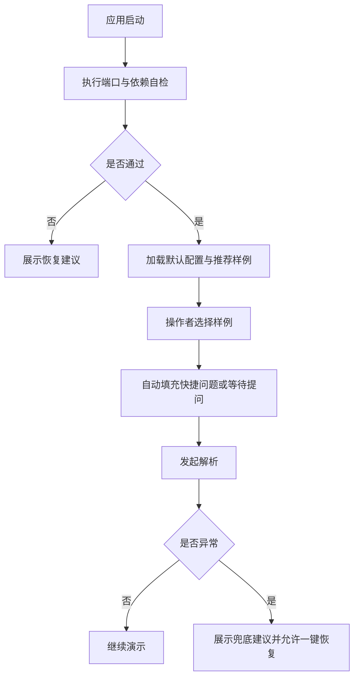

#### 3.5.7 异常/分支流程

| 场景 | 触发条件 | 处理方式 | 提示文案 |
|------|---------|---------|---------|
| 端口冲突 | 启动阶段检测端口已占用 | 展示冲突端口与建议端口 | “检测到端口冲突，请切换到建议端口后重启。” |
| 推荐样例缺失 | 样例文件不存在 | 隐藏该样例并提示维护者 | “推荐样例缺失，请检查本地素材目录。” |
| 连续任务串台 | 上一任务未结束时切换样例 | 强制取消旧任务 | “已切换到新样例，旧任务结果已清空。” |

#### 3.5.8 数据字典

| 字段名 | 类型 | 必填 | 说明 | 示例值 |
|--------|------|------|------|--------|
| demo_sample_id | String | 否 | 推荐样例标识 | sample_pdf_001 |
| health_check_status | Enum | 是 | pass/fail/warn | pass |
| conflict_port | Int | 否 | 冲突端口 | 7860 |
| recovery_action | String | 否 | 建议恢复动作 | switch_port |

### 3.6 异常处理与状态反馈

#### 3.6.1 描述
负责统一定义所有关键状态的可视化反馈方式，避免“无提示卡住”“结果区空白但不知原因”等体验问题。

#### 3.6.2 用户故事
作为用户，我希望在任何一步都知道系统当前在做什么、失败在哪里、下一步该怎么办，以便降低试错成本。

#### 3.6.3 前置条件

| 类型 | 条件 |
|------|------|
| 数据依赖 | 全流程各模块均需接入统一状态定义 |
| 权限依赖 | 无 |
| 功能依赖 | 依赖 3.1 至 3.5 的状态回传 |

#### 3.6.4 后置条件
1. 用户可感知当前流程状态。
2. 失败状态具有明确恢复建议。
3. 关键异常写入本地日志 [待确认]。

#### 3.6.5 界面及交互

| 元素 | 类型 | 必填 | 默认值 | 校验规则 | 操作反馈 |
|------|------|------|--------|---------|---------|
| 全局状态条 | 标签/提示条 | 是 | 待机中 | 按状态切换颜色与文案 | 实时展示当前阶段 |
| 错误详情区 | 可展开区域 | 否 | 收起 | 有错误时显示 | 支持查看错误码 |
| 重试按钮 | 按钮 | 否 | 隐藏 | 失败后可点 | 重新发起任务 |
| 清空状态按钮 | 按钮 | 否 | 隐藏 | 任意任务后可见 | 清空当前任务状态 |

#### 3.6.6 业务流程

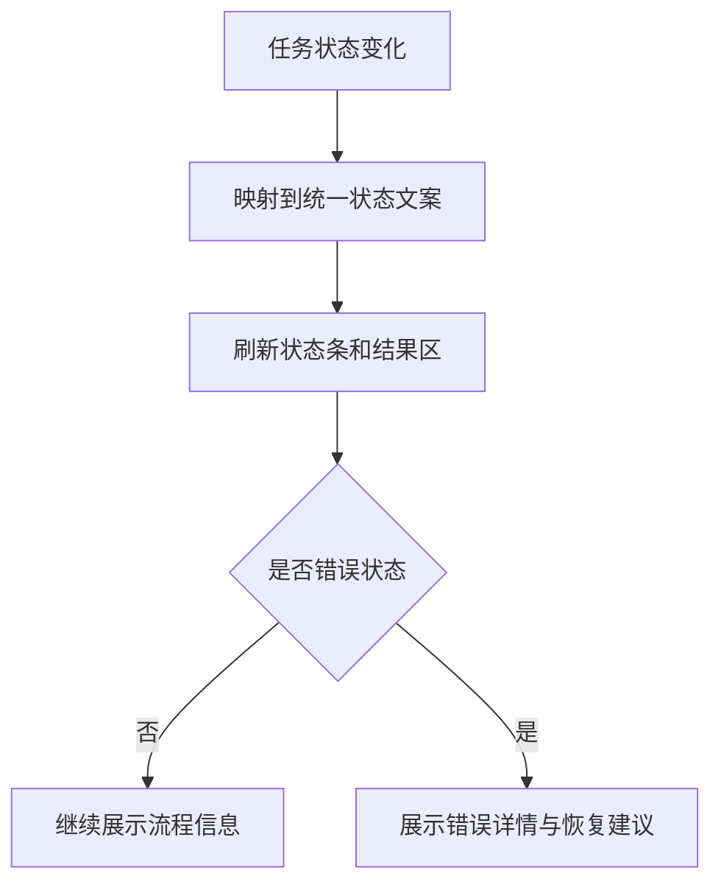

#### 3.6.7 异常/分支流程

| 场景 | 触发条件 | 处理方式 | 提示文案 |
|------|---------|---------|---------|
| 状态未返回 | 后端未返回任务状态 | 使用超时兜底文案 | “当前状态获取失败，请稍后重试。” |
| 错误文案不可读 | 返回技术错误 | 转换为用户可读提示，并记录原始错误日志 | “系统异常，请重试或联系维护者。” |
| 结果为空 | 接口成功但内容为空 | 展示空结果说明 | “未生成有效结果，建议调整问题后重试。” |

#### 3.6.8 数据字典

| 字段名 | 类型 | 必填 | 说明 | 示例值 |
|--------|------|------|------|--------|
| ui_status | Enum | 是 | idle/uploading/parsing/streaming/success/error | parsing |
| status_message | String | 是 | 面向用户的状态文案 | 正在解析文档内容 |
| retryable | Boolean | 是 | 是否可重试 | true |
| raw_error | String | 否 | 原始错误信息 | connection timeout |

### 3.7 前端重构与产品化迁移

#### 3.7.1 描述
用于明确 SnapExtract 从 Gradio 比赛 Demo 过渡到正式产品前端的范围、阶段、边界与交付要求，避免当前阶段在错误技术层上过度建设，或赛后重构时推倒重来。

#### 3.7.2 用户故事
作为产品负责人，我希望当前决赛版的前端优化能够服务比赛展示，同时为赛后产品化重构预留清晰边界，以便减少重复开发。

作为研发负责人，我希望明确哪些能力继续放在 Gradio 内增强，哪些能力必须在正式前端重构后落地，以便合理安排技术债与演进节奏。

#### 3.7.3 前置条件

| 类型 | 条件 |
|------|------|
| 数据依赖 | 当前 Demo 已基于 Gradio 完成上传、提问、结果输出主链路 |
| 权限依赖 | 无 |
| 功能依赖 | 依赖 3.1 至 3.6 已定义的比赛版交互、状态与配置能力 |

#### 3.7.4 后置条件
1. 决赛版前端优化与赛后产品化重构边界明确。
2. 比赛版页面结构尽量贴近正式产品的信息架构。
3. 赛后正式前端重构具备清晰目标模块与解耦要求。

#### 3.7.5 界面及交互

| 元素 | 类型 | 必填 | 默认值 | 校验规则 | 操作反馈 |
|------|------|------|--------|---------|---------|
| 比赛版主界面框架 | 页面框架 | 是 | 当前单页结构 | 必须拆分为上传、预览、提问、结果、设置、样例六区 | 页面层次清晰、适合演示 |
| 正式产品导航预留 | 信息架构 | 否 | 无 | 决赛版可不完整实现，但需预留工作台/任务/设置/历史等导航概念 | 降低后续重构返工 |
| 组件样式规范 | 样式规则 | 是 | 当前轻量样式 | 核心组件命名、层级、状态需统一 | 提升一致性 |
| 技术栈迁移清单 | 文档/配置 | 是 | 无 | 需明确哪些逻辑保留、哪些逻辑迁出页面层 | 作为赛后重构输入 |

#### 3.7.6 业务流程

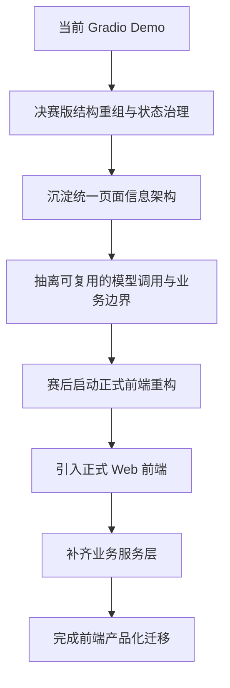

#### 3.7.7 异常/分支流程

| 场景 | 触发条件 | 处理方式 | 提示文案 |
|------|---------|---------|---------|
| 在 Gradio 中过度堆功能 | 将历史任务、权限、复杂后台直接塞入比赛版 | 立即收敛范围，保留为 V2.0 需求 | “该能力属于产品化阶段，不纳入决赛版实现。” |
| 页面逻辑与模型逻辑强耦合 | 前端组件直接绑定推理细节 | 在赛后重构中优先拆分服务边界 | “当前页面逻辑耦合过深，需进入解耦重构清单。” |
| 比赛版视觉与正式产品方向完全脱节 | 赛后需完全推翻视觉和信息结构 | 当前阶段补做设计规范和模块边界梳理 | “比赛版需向正式产品信息架构靠拢。” |

#### 3.7.8 数据字典

| 字段名 | 类型 | 必填 | 说明 | 示例值 |
|--------|------|------|------|--------|
| frontend_stage | Enum | 是 | demo/productized | demo |
| ui_shell_type | Enum | 是 | gradio/web_app | gradio |
| target_frontend_stack | String | 否 | 正式前端技术栈 | Next.js |
| service_boundary_defined | Boolean | 是 | 是否已定义页面层与服务层边界 | false |
| migration_status | Enum | 否 | pending/planning/in_progress/done | planning |

## 四、非功能需求（注意事项）

### 4.1 安全与合规需求

| 需求 | 说明 |
|------|------|
| 端侧优先 | 所有核心解析任务默认在本地执行，避免素材上传外部服务 |
| 隐私保护 | 演示与使用素材默认不出端，符合项目“隐私安全”核心价值表达 |
| 临时数据清理 | 当前会话结束后，临时文件与缓存应可清理 [待确认] |
| 本地日志脱敏 | 日志中不得记录完整敏感原文，必要时仅记录摘要与错误码 [待确认] |
| 配置可控 | 模型与提示词的变更应有边界校验，避免错误配置导致系统失稳 |
| 前端重构边界 | 比赛版不得在 Gradio 中沉淀过多长期产品能力，避免形成更高迁移成本 |

### 4.2 统计需求（埋点）

| 事件名 | 触发时机 | 属性 | 说明 |
|--------|---------|------|------|
| page_view | 应用主界面加载完成 | page_name, launch_mode | 统计应用进入情况 |
| upload_file | 文件上传成功 | file_type, file_size, task_id | 统计素材类型分布 |
| select_demo_sample | 选择推荐样例 | sample_id, sample_type | 统计演示样例使用情况 |
| submit_question | 点击提交问题 | task_id, question_length, language_mode | 统计发问行为 |
| parse_success | 任务成功完成 | task_id, file_type, duration_ms, output_language | 统计成功率与耗时 |
| parse_fail | 任务失败 | task_id, file_type, error_code | 统计失败原因 |
| setting_change | 保存设置 | model_id, language_mode, output_format | 统计配置偏好 |
| export_result | 复制或导出结果 | task_id, export_type | 统计结果后处理行为 |
| frontend_shell_used | 页面壳层渲染完成 | shell_type, version_stage | 统计比赛版/产品化前端阶段 |
| migration_checkpoint | 前端重构关键里程碑完成 | milestone_name, status | 跟踪赛后产品化进度 |

### 4.3 性能需求

| 指标 | 要求 |
|------|------|
| 首次进入主界面时间 | <= 5s [待确认：受本地模型加载策略影响] |
| 单轮任务首段结果返回时间 | 应尽量在 5s 内给出首段结果 [待确认] |
| 预览刷新时间 | 文件切换后 1s 内清空旧状态并开始展示新预览 [待确认] |
| 演示成功率 | 标准样例连续演示成功率 >= 95% |
| OCR 目标精度 | 目标 95%，需以标准测试集复核，不作为当前稳定承诺 |
| 系统稳定性 | 连续多轮任务执行不出现结果串台、旧预览残留、界面冻结 |
| 前端可迁移性 | 比赛版信息架构、状态命名、配置模型需可映射到正式产品前端 [待确认：评审标准] |

### 4.4 数据库设计
本项目当前为本地 Demo，不强依赖正式数据库。若需保存本地配置、样例元数据或日志，可采用轻量配置文件或本地存储方案。

| 数据对象 | 存储方式 | 说明 |
|---------|---------|------|
| 本地配置 | 配置文件 [待确认] | 存储默认模型、语言、格式等 |
| 推荐样例元数据 | 本地配置文件 [待确认] | 存储样例名称、类型、路径、推荐问题 |
| 运行日志 | 本地日志文件 [待确认] | 记录错误码、耗时、启动诊断结果 |

### 4.5 系统集成

| 对接系统 | 接口方向 | 协议 | 说明 |
|---------|---------|------|------|
| 本地模型推理服务 | 调用 | 本地进程/本地接口 [待确认] | 执行视觉理解与问答 |
| PDF 渲染组件 | 调用 | 本地库 | 用于 PDF 转图与预览生成 |
| OCR/预处理组件 | 调用 | 本地库 [待确认] | 用于纯图 PDF 或图像文本抽取 |
| Gradio 前端 | 同进程/本地服务 | 本地 Web | 提供主界面与交互能力 |
| 正式 Web 前端 | 调用 | HTTP/HTTPS [待确认] | 产品化阶段承载正式工作台与多页面能力 |
| 业务服务层 | 双向 | HTTP REST / 内部服务 [待确认] | 承接任务、配置、日志、文件与导出管理 |

## 五、附录（补充文档）

### 5.1 验收标准与测试要点

| 功能 | 验收条件 | 优先级 |
|------|---------|--------|
| 图片理解 | 上传单图后，系统可输出对象识别、场景描述与问题回答 | P0 |
| PDF 理解 | 上传文本型 PDF 后，可生成摘要、回答问题、抽取重点 | P0 |
| 纯图 PDF 处理 | 对可识别素材返回结果；低置信度时明确提示风险与建议 | P0 |
| 公式识别 | 可从公式图片中提取内容并输出可编辑表达 | P0 |
| 流程图理解 | 可识别主要节点与流程主线，并给出结构化概括 | P0 |
| 表格问答 | 可对表格中的指定字段进行精确定位并回答 | P0 |
| 语言一致性 | 中文输入默认中文输出，英文输入默认英文输出，手动指定语言优先级最高 | P0 |
| 设置中心 | 修改模型、提示词、输出格式、语言设置后，仅对新任务生效，旧任务结果不串台 | P0 |
| 预览刷新 | 切换素材后，不保留上一份文件的预览与结果 | P0 |
| 异常兜底 | 模型超时、文件不支持、端口冲突、预览失败等场景均有明确提示与恢复建议 | P0 |
| 演示模式 | 可一键加载五类推荐样例，且连续演示过程中不出现界面错乱或状态混乱 | P0 |
| 导出结果 | 结果可复制，导出能力按接入范围生效 [待确认] | P1 |
| 前端重构边界 | 决赛版仅在 Gradio 内完成结构与状态升级，不承载长期产品后台能力 | P0 |
| 产品化迁移方案 | PRD 中明确正式前端重构目标、业务服务层边界与迁移阶段 | P1 |

### 5.2 待确认与假设说明
1. `[待确认]` 表示当前材料未给出充分事实，需要在研发或比赛准备阶段进一步确认。
2. `[假设]` 表示为了形成可执行 PRD 做出的合理默认设定，后续如有新事实可替换。
3. 纯图 PDF 能力、OCR 95% 精度、具体端口策略、日志字段、导出格式范围等均不得在外部表达中作为已完全稳定能力。
4. 前端产品化阶段的正式技术选型、服务层协议与迁移排期属于需进一步确认内容，但“赛后重写正式前端”已作为方向性需求写入。
