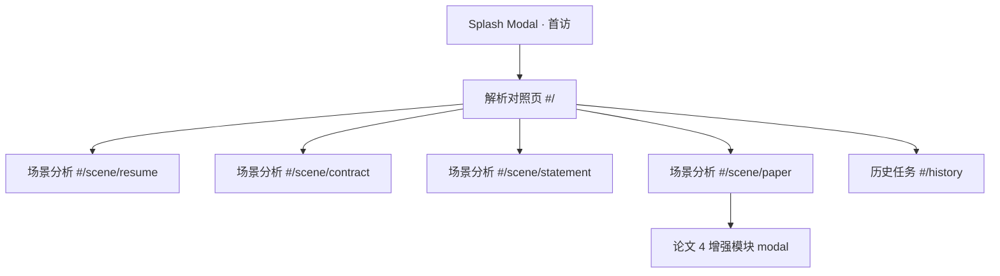

# SnapExtract 产品需求文档 V2.3.0

| 版本 | 时间 | 修订人 | 备注 |
|------|------|--------|------|
| V2.0.0 | 2026/04/28 | 毛睿平 | 场景化重构草稿 |
| V2.1.0 | 2026/04/30 | 毛睿平 | 双层叙事重构：用户价值 + 骁龙端侧价值 |
| V2.2.0 | 2026/05/06 | 毛睿平 | 全局状态规则、字段级红黄提醒、baseline 演示口径与验收标准 |
| V2.3.0 | 2026/05/07 | 毛睿平 | **解析与分析分离**：首页改为通用解析对照页，场景分析降为二级 |

## 一、概述

### 1.1 本版本核心变化

V2.2.0 把首页定位为"4 主文件上传中枢"，每个文件强绑定到一个场景。本版本基于产品演示反馈，把「**解析**」和「**分析**」明确拆成两个能力、两步路径：

1. **首页 = 通用解析对照页**：用户上传任意支持文件，立即看到「未解析 / Tesseract / SnapExtract」三屏对照，证明端侧解析能力差异。
2. **解析完成后 → 自动识别文档类型 → 进入对应场景分析**（简历 / 合同 / 对账单 / 论文）。

旧的"4 主文件分别上传 → 直接进入对应场景"叙事被废弃，原因：它要求用户在还没看到任何能力之前就选场景，对评委演示极不利。新的逻辑是「先证明能力，再让用户选择是否深度分析」。

### 1.2 设计原则

1. **解析先行**：第一屏让评委看到解析能力差异，再让用户选场景深度分析。
2. **单屏承载**：所有页面控制在 100vh 内，超出内容用嵌套 modal / drawer 承载，不滚动。
3. **品牌克制**：精简顶部 nav，删除搜索 / DEMO 切换 / 设置入口，视觉聚焦核心动作。
4. **结果即产物**：取消「导出产物」独立按钮，分析结果在场景内直接展示和可复制。
5. **演示连续**：从 Splash → 解析 → 场景，全链路不需要返回首页或多窗口拼接。

### 1.3 与 V2.2.0 比对（覆盖关系）

| 项目 | V2.2.0 | V2.3.0 | 处置 |
|---|---|---|---|
| 首页主体 | 4 主文件上传中枢 | 解析对照页（三屏） | **替换** |
| 场景入口 | 首页直接 4 个入口 | 解析后单一入口（自动识别） | **替换** |
| baseline 对照 | 场景内第 02 步、默认折叠 | 首页主视图 | **升级** |
| 顶部 nav 按钮 | 搜索 / 历史 / 设置 / DEMO | 仅历史 | **简化** |
| 导出产物按钮 | 场景底部 ActionBar 中 | 移除 | **移除** |
| Splash 引导 | 无 | 首访自动弹出（含品牌叙事） | **新增** |
| 顶部进度指引 | 无（仅场景内 6 步 timeline） | 全局 3 步 stepper | **新增** |
| 场景内 6 步流程 | 保留 | 保留 | 不变 |
| 4 论文增强模块 | 场景右栏内嵌 | 场景内点击 → 弹出 modal | **形式调整** |
| 单屏约束 | 无 | 强制（100vh） | **新增** |

## 二、产品描述

### 2.1 用户旅程

```
[首次访问]
   ↓
Splash Modal （品牌 slogan + 实机演示屏 + 38ms/4/0 stats + ticker）
   ↓ 关闭
[解析对照页 = 新首页]
   ├ 顶部 stepper：① 上传 → ② 解析对照 → ③ 场景分析
   ├ 左 sidebar：示例文件 + 最近任务（无功能按钮）
   ├ 中央三屏：① 未解析 │ ② Tesseract │ ③ SnapExtract
   └ 底部差异指标条
   ↓ 用户上传 / 点示例文件
[三屏并发解析动画]
   ↓ 完成
[SnapExtract 屏顶部出现：✓ 识别为 X → 进入 X 场景分析]
   ↓ 点击 CTA
[场景分析页 — 单屏]
   ├ 顶部 6 步演示 timeline
   ├ 左：主文件 / 补充材料 / 预览
   ├ 中：baseline + 解析状态 + 三列子卡（字段 / 重点 / 总结）
   └ 右：场景视图清单
   ↓ 论文场景：点视图项弹 modal（4 增强模块）
   ↓ 在场景内直接看分析结果（无导出步骤）
```

### 2.2 信息架构



### 2.3 顶部导航最终样子

```
[≡ SnapExtract · AI Document Workbench]    [简历][合同][对账单][论文]    [⏱ 历史]
```

去掉的项：搜索 ⌘K、DEMO 切换、设置 ⚙。

### 2.4 全局状态原则

继承 V2.2.0，新增首页解析态：

| 状态节点 | 触发时机 | 前端表现 | 系统规则 |
|---|---|---|---|
| splash | 首次访问站点 | Splash Modal 弹出 | localStorage 写 `snapextract_seen_splash=1`，二次访问跳过 |
| 解析空闲 | 进入首页或上传前 | 三屏均空状态、stepper 第 1 步 active | 上传按钮可点 |
| 解析校验 | 文件被拖入 / 选中 | 校验文件格式 / 大小 | 不通过 → 红色提示，通过 → 进入解析中 |
| 解析中 | 校验通过 | 第 1 屏 = 原文渲染；第 2/3 屏 shimmer + 扫描光束 | Tesseract 在 ~1.8s 出文（OCR 碎片），SnapExtract 在 ~3.5s 出文（结构化） |
| 解析完成 | 三屏全部完成 | stepper 推进到第 2 步 done；SnapExtract 屏顶部展示「✓ 识别为 X」CTA | 自动识别文档类型，绑定到下一步场景 |
| 场景分析 | 用户点 CTA 进场景页 | stepper 第 3 步 active；场景页打开并预填解析数据 | 解析上下文沿用，不再重新上传 |
| 场景结果 | 场景页 6 步流程完成 | 字段卡 / 重点 / 总结直接展示 | **无导出按钮**：用户可复制单字段 / 整段，或截图 |

**统一约束**（继承 V2.2.0）：同一时刻工作台只绑定一个解析任务，切换文件立即清空旧场景结果。

### 2.5 4 条核心要求 → 对齐结果

| # | 老板要求 | 实现 |
|---|---|---|
| 1 | 首页解析-通用入口，三屏对照 | 解析对照页 = 新首页；上传 → 三屏并排，组件排列参考 SoMark |
| 2 | 首屏弹窗，关闭即进入解析页 | Splash Modal，**首访 only**（localStorage） |
| 3 | 展示解析效果后再进入场景分析 | SnapExtract 屏顶部固定「识别为 X → 进入 X 场景分析」CTA |
| 4 | 添加进度提示演示进度 | 顶部 3 步 stepper：① 上传 → ② 解析对照 → ③ 场景分析 |

### 2.6 三屏内容设计

| 屏 | 上传前 | 上传后（解析中） | 解析完成 |
|---|---|---|---|
| ① 未解析 | 拖拽提示 + 支持格式列表 | 原文 PDF/图片渲染 | 原文（保留） |
| ② Tesseract | 灰色"未启动"占位 | shimmer 进度条（~1.8s） | OCR 碎片文本（带行错位、识别错字、字段散落） |
| ③ SnapExtract | 灰色"未启动"占位 | shimmer + 扫描光束（~3.5s） | 结构化 markdown（标题层级、字段卡、红黄边界） |

第 1 屏支持的文件格式（沿用 SoMark 同款列表）：
PDF · PNG · JPG · JPEG · BMP · TIFF · JP2 · DIB · PPM · PGM · PBM · GIF · HEIC · HEIF · WEBP · XPM · TGA · DDS · XBM · DOC · DOCX · PPT · PPTX

### 2.7 差异指标条

底部固定一行，量化三屏差异：

```
未解析             Tesseract               SnapExtract
0 字段抽取         12 字段（碎片）         8 字段（结构化 + 红黄边界）
—                  准确率 64%             准确率 96% · 含语义判断
```

数字根据上传文件类型动态渲染（4 套预设：简历 / 合同 / 对账单 / 论文）。

### 2.8 文档类型自动识别

解析完成后，根据文件名 keyword + mock 内容签名判断：

| 关键字命中 | 识别为 | CTA |
|---|---|---|
| `resume` / `cv` / `简历` | 简历 | → 进入简历场景分析 |
| `contract` / `agreement` / `nda` / `合同` / `协议` | 合同 | → 进入合同场景分析 |
| `statement` / `bank` / `receipt` / `对账` / `流水` / `单据` | 对账单 | → 进入对账单场景分析 |
| `paper` / `arxiv` / `论文` / `nips` / `attention` | 论文 | → 进入论文场景分析 |
| 无命中 | 论文（fallback） | → 进入论文场景分析 |

### 2.9 单屏约束（关键）

| 页面 | 总高 | 顶 nav | 主区 | 底部 |
|---|---|---|---|---|
| 解析对照页 | 100vh | 56 | stepper 70 + (sidebar + 三屏) 自适应 | 差异指标条 60 + ticker 32 |
| 场景页 | 100vh | 56 | 6 步 timeline 60 + 三栏主区自适应 | ticker 32 |

超出内容处理：
- 论文 4 增强模块 → 改为弹出全屏 **modal**（不挤主区）
- Layer 3 三列子卡 → 高度收紧到 ~140px
- 字段级红黄 → 行内 chip + tooltip（不增加垂直高度）

## 三、功能需求

### 3.1 Splash Modal

#### 3.1.1 触发与生命周期
- 首次访问 `#/` 自动弹出
- localStorage 写入 `snapextract_seen_splash=1`
- 二次访问跳过
- 隐藏触发：双击 logo 重新唤起（彩蛋 / 演示用）

#### 3.1.2 内容（保留 V3 hero 整块）
- v2.0 chip
- 主标「高敏文档，从此不再上云。」
- 副标「面向 AI PC 的高敏文档智能处理工作台。一个统一内核，承载四个独立场景：上传 · 理解 · 判断 · 带走。」
- CTA：「立即体验」（关闭 modal）/「看演示」（关闭 + 触发上传一份预置示例）
- 38ms / 4 / 0 三段 count-up stats
- 实机演示屏（5 机位相机循环）
- 底部 ticker 8 条

#### 3.1.3 关闭方式
ESC / ✕ / 「立即体验」/ 「看演示」/ 点击背景遮罩

### 3.2 解析对照页（首页）

#### 3.2.1 顶部 stepper

```
[① 上传]──────[② 解析对照]──────[③ 场景分析]
   active            locked              locked
```

锁定逻辑：
| 步骤 | 解锁条件 | 状态切换 |
|---|---|---|
| ① 上传 | 始终可点 | 默认 active |
| ② 解析对照 | 文件上传后 | 上传完成自动 active；解析完成后 done |
| ③ 场景分析 | 解析完成 + 识别成功 | 自动可点；点 CTA 后 active |

#### 3.2.2 左 sidebar

宽度 200px，固定。**只有内容、无功能按钮**：

```
解析记录（最近任务，最多 5 条）
  · doe_resume.pdf            2 min ago
  · acme_nda.pdf              1 hr ago
  ...

示例文件（点击直接载入解析）
  · 示例文件（金融研报）
  · 示例文件（财报招股书）
  · 示例文件（学术论文）
  · 示例文件（专利文件）
  · 示例文件（编程书）
  · 示例文件（各学科试卷）
  · 示例文件（各学科练习册）
  · 示例文件（各学科教科书）
  · 示例文件（扫描书）
  · 示例文件（表格单据）
```

无最近任务时显示：「还没有您的解析记录」。

#### 3.2.3 中央三屏

三栏等宽（自适应剩余宽度）。每屏顶部带迷你工具栏（上传前不显示）：

```
┌────────────────────────────┬────────────────────────────┬────────────────────────────┐
│ ① 未解析                   │ ② Tesseract                │ ③ SnapExtract              │
│  < > 1/1 ⊕⊖              │  MD-Raw                    │  MD-Preview · MD-Raw · JSON│
├────────────────────────────┼────────────────────────────┼────────────────────────────┤
│                            │                            │ ✓ 识别为「合同」          │
│   原文 PDF / 图片渲染      │   OCR 碎片文本            │   → 进入合同场景分析 →    │
│                            │   （带错字 / 行错位）     │ ─────────────────────────  │
│                            │                            │                            │
│                            │                            │   结构化 markdown          │
│                            │                            │   ┌── 字段卡 ──────────┐  │
│                            │                            │   │ 姓名: M. Doe       │  │
│                            │                            │   │ 学历: 硕士 · CS    │  │
│                            │                            │   └────────────────────┘  │
│                            │                            │                            │
└────────────────────────────┴────────────────────────────┴────────────────────────────┘
```

#### 3.2.4 底部差异指标条

```
未解析         Tesseract               SnapExtract
0 字段抽取    12 字段（碎片）         8 字段（结构化 + 红黄边界）
—            准确率 64%              准确率 96% · 含语义判断
```

数据按文件类型动态切换。

#### 3.2.5 上传方式
- 拖拽到第 1 屏
- 点第 1 屏中央上传图标
- 截图后 Ctrl+V 粘贴
- 点 sidebar 任意示例文件 → 自动载入对应预置数据

### 3.3 场景页（重构 — 单屏）

#### 3.3.1 进入路径
1. 用户在解析对照页点 SnapExtract 屏的「→ 进入 X 场景分析」 CTA
2. 通过顶部 nav 4 场景 chip 直接进入（要求该场景已有解析任务，否则跳回首页）
3. 通过历史任务点击重开

#### 3.3.2 顶部 6 步 timeline（沿用 V2.2.0）

```
01 原始材料 → 02 baseline → 03 补充材料 → 04 解析 → 05 结果物 → 06 留存追问
```

baseline 默认折叠（PRD V2.2.0 已确认决策）。

#### 3.3.3 三层结构（**单屏压缩版**）

| 层 | 高度 | 内容 |
|---|---|---|
| 第一层（左栏 col-3） | 全高 | 主文件卡（紧凑）+ 补充材料槽位 + 原文预览（缩略） |
| 第二层（中栏 col-6 上） | ~280px | baseline 折叠条 + 解析状态 + 主结果摘要 |
| 第三层（中栏 col-6 下） | ~140px | 三列子卡：字段卡 / 重点判断 / 总结建议（高度收紧） |
| 右栏（col-3） | 全高 | 场景视图清单 + 视图预览 |

底部 sticky ActionBar：**已删除「导出产物」按钮**。仅保留：复制 / 重试 / 切换文件 / 返回首页。

#### 3.3.4 字段级红黄提醒
- 行内 chip + tooltip（不增加垂直高度）
- 「参考性判断 · 不构成确定结论」降级标签放在总结建议子卡顶部 mono chip

### 3.4 论文 4 增强模块（modal 化）

#### 3.4.1 入口
论文场景页右栏视图清单中的 4 个 lab.* 视图项。点击 → 弹出**全屏 modal**（不在主屏内展开）。

#### 3.4.2 解锁逻辑
继承 V2.2.0：requireMain（必须有主文件）。未上传主文件时视图项灰色 `🔒`。

#### 3.4.3 4 模块（沿用既有实现）
1. 公式翻转卡（4 个 AIAYN 公式 tab + 3D 翻面）
2. PDF 分层视图（4 层独立 toggle）
3. 相关性热力图（with/without context）
4. 指点提问（4 区域 + 自动循环 + 答案打字）

#### 3.4.4 modal 关闭
ESC / ✕ / 点击背景遮罩 → 回到场景页主区。

## 四、附录

### 4.1 验收标准

| 项目 | 验收标准 | 优先级 |
|------|---------|--------|
| Splash 首访 | 首次访问 `#/` 弹出 modal；二次访问不弹（localStorage 标记生效）| P0 |
| Splash 关闭路径 | ESC / ✕ / CTA / 背景点击均能关闭 | P0 |
| 顶 nav 精简 | 只有 logo / 4 场景 chip / 历史；无搜索 / DEMO / 设置 | P0 |
| 三屏布局 | 上传前空状态；上传后未解析屏即时显示原文，Tesseract / SnapExtract 错时填充 | P0 |
| stepper 推进 | ① 默认 active；上传后 ② 自动 active；解析完成 ② done；点 CTA 后 ③ active | P0 |
| 自动识别 | 文件名命中 4 类关键字时 SnapExtract 屏顶部展示对应 CTA；无命中 fallback 到论文 | P0 |
| 单屏约束 | 解析对照页和 4 场景页在 1440 × 900 下不出现垂直滚动条 | P0 |
| 导出产物移除 | 场景页底部 ActionBar 不含导出按钮 | P0 |
| 论文 4 增强模块 modal | 点击视图项弹出全屏 modal；ESC 关闭回到主区 | P0 |
| 差异指标条数据 | 4 类文件分别预设 4 套数据 | P1 |
| sidebar 示例文件 | 点击载入对应预置数据并触发解析 | P1 |
| 字段级红黄 | 字段卡上挂 chip + tooltip 显示原因 | P1 |

### 4.2 已废弃 / 移除项

| 项 | 原所在位置 | 移除原因 |
|---|---|---|
| 4 主文件上传槽位卡 | 旧首页 | IA 反转，被三屏 + 通用上传取代 |
| 推荐演示卡片区 | 旧首页 | 示例载入并入 sidebar |
| 顶 nav 搜索按钮 | 顶 nav | 简化 |
| 顶 nav DEMO 切换 | 顶 nav | 简化（内部 flag 保留） |
| 顶 nav 设置按钮 | 顶 nav | 简化 |
| 导出产物 ActionBar 按钮 | 场景页底部 | 结果直接展示，不再需要离线带走 |
| 隐私雷达浮动面板 | 拟做（V2.2.0 拟做） | 单屏约束下挤压主区，去掉 |

### 4.3 默认假设

1. 数据全部 mock，前端不依赖任何后端 API。
2. 4 类文档识别基于关键字 + mock 签名，不做真实 OCR 推理。
3. Tesseract 输出为预设碎片文本，SnapExtract 输出为预设结构化 markdown，按文件类型映射。
4. 现场演示主屏分辨率默认 ≥ 1440 × 900，单屏约束基于此基准。
5. 视觉系统沿用 V3 焰橙→玫红 sunset palette，不引入新色板。

## 五、后续 roadmap（不在本版交付）

- BaselineCompare 三栏对照组件升级（含 Tesseract 实测数据）
- 真实 NPU 推理对接 / 真实 Tesseract 端侧调用
- 历史任务 / 设置中心字段 schema 完善
- 多语言切换（zh/en）
- 多文档对比（论文场景增强）
