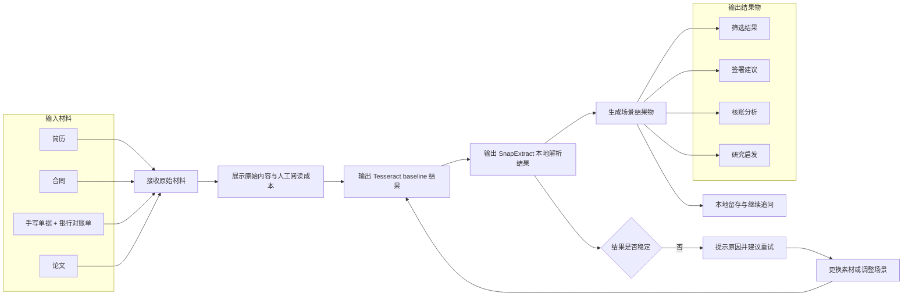

# SnapExtract 产品需求文档 V2.1.0

| 版本 | 时间 | 修订人 | 备注 |
|-|-|-|-|
| V1.0.0 | 2026/04/22 | 毛睿平 | 决赛优化版 PRD（按素材类型组织） |
| V1.0.1 | 2026/04/24 | 毛睿平 | 补充前端增强功能条目 |
| V2.0.0 | 2026/04/28 | 毛睿平 | 场景化重构草稿：从五类素材收束为四类业务场景 |
| V2.1.0 | 2026/04/30 | 毛睿平 | 双层叙事重构：从实现导向调整为用户价值 + 骁龙端侧价值 |

---

## 一、概述

### 1.1 产品概述及目标

#### 1.1.1 背景介绍

AI PC 的价值，落点不在“电脑里也能跑模型”，而在“很多原本必须上云的智能处理，现在可以留在本地完成”。这件事对高敏知识工作者尤其重要。

合同、简历、银行对账单、论文这类资料有三个共同点。第一，资料本身包含敏感信息，用户天然会谨慎对待外发。第二，用户关心的是任务结果，例如合同能不能签、对账单有没有异常、候选人值不值得继续看。第三，处理过程通常是连续的，需要经历上传、理解、提取、判断、总结和留存几个环节。

现有工具在这条链路上都有缺口。本地工具擅长查看和编辑，理解能力弱；云端 AI 具备理解能力，但用户要先接受资料离开设备、网络状态不稳定、交互链路不完全可控。对高敏资料场景来说，这三个前提会阻碍用户使用。

SnapExtract 的机会点很明确：把高敏资料处理完整地放回本机，把“解析、重点提取、判断、总结、导出”连成一条可执行的工作流。骁龙 AI PC 的端侧能力决定了这条工作流能否成立。只有本地推理速度、连续交互能力和运行稳定性都达到可用水平，“隐私不出本机”才会从安全主张变成真实体验。

#### 1.1.2 产品概述

SnapExtract 是一款运行在骁龙 AI PC 上的本地敏感文档智能处理工具，服务高敏知识工作者，聚焦四类高频任务：简历、合同、银行对账单和论文。产品通过统一的端侧处理链路，帮助用户完成从文档解析、结构化提取、重点判断到总结产物输出的完整闭环。

产品的核心承诺有四条：

1. 文档尽量留在本机处理；
2. 用户可以获得足够快的首轮响应和持续交互；
3. 每个场景都输出可带走、可复用、可汇报的结果；
4. 用户感知到的是任务完成度，而不是模型参数或单点能力。

#### 1.1.3 产品目标

**用户目标**

| 目标 | 说明 | 成功标准 |
|-|-|-|
| 在本机完成高敏资料处理 | 用户在本地完成解析、重点提取、总结与导出 | 每个核心场景都能完成“上传 → 判断 → 总结 → 产物”闭环 |
| 降低资料上云顾虑 | 用户无需把合同、简历、对账单、论文等材料交给外部云服务 | 文档默认本地处理，边界表达清晰 |
| 提升结果可用性 | 用户拿到的是可直接判断、汇报、归档或继续使用的结果 | 每个场景至少输出 1 项可带走产物 |

#### 1.1.4 目标用户

**第一目标用户：高敏知识工作者**

| 用户类型 | 典型资料 | 核心诉求 |
|-|-|-|
| HR | 简历、岗位资料 | 快速判断候选人是否值得继续看 |
| 业务签字人  | 合同、协议 | 快速判断条款风险和是否值得签 |
| 个体经营者 | 银行对账单、流水材料 | 快速判断资金是否异常、流向是否清晰 |
| 学生 | 论文、研究资料 | 快速判断内容是否值得深读、如何沉淀知识 |

---

## 二、产品描述

### 2.1 产品需求描述

SnapExtract 面向的是一条连续任务链。高敏知识工作者在一天里会不断接收和处理不同类型的资料：看简历、审合同、对账、读论文。资料形态不同，处理目标却高度一致。

用户通常都要完成五步：

1. 确认这份资料是什么；
2. 快速理解主要内容；
3. 找到当前任务最重要的判断点；
4. 形成可复述、可汇报、可继续处理的结果；
5. 把资料和结果尽量留在本机。

这四个场景只是不同高频任务的入口，本质上它们共用同一套本地处理链路、同一套结果组织方式，也共用同一条平台价值主线。

### 2.2 产品整体流程

#### 2.2.1 统一主故事

一位高敏知识工作者在日常工作中不断处理敏感资料。

他打开一份简历，想知道候选人是否值得继续推进；他收到一份合同，想尽快判断哪些条款需要确认或修改；他处理手写单据和银行对账单，想完成核对、验算和结果分析；他阅读论文，想判断这篇材料对自己的研究是否有直接价值。

这些任务虽然来自不同文档，但在演示和产品逻辑上都应遵循同一条链路：

`查看原始材料 → 查看 baseline 结果 → 查看 SnapExtract 结果 → 输出场景结果物 → 本地留存与复用`

SnapExtract 的统一价值，不只是把内容识别出来，而是在本机把“原始资料”升级为“可判断、可汇报、可继续处理的结果”。

#### 2.2.2 场景在统一故事中的角色

| 场景 | 用户核心问题 | 用户最终想拿到的结果 |
|-|-|-|
| 简历 | 这个人值不值得继续推进 | 信息卡片、综合评价、面试问题 |
| 合同 | 这份条款能不能签、哪些地方要改 | 信息提取、风险点识别、建议 |
| 对账单 | 账是否对得上、资金是否有异常 | 手写单据识别结果、银行对账单结构化结果、比对结果、验算结果、分析结果 |
| 论文 | 这篇材料对我的研究有没有直接价值 | 研究问题、使用方法、核心结果、对自己论文的作用 |

#### 2.2.3 主流程



#### 2.2.4 产品组织原则

这版产品描述围绕四条原则展开：

1. 同一套工作台处理四类高敏资料；
2. 同一套对照链路展示原始材料、baseline 和结果物之间的差异；
3. 同一套结果结构服务判断、汇报和留存；
4. 体验增强能力服务理解，不喧宾夺主。

### 2.3 全局说明

#### 2.3.1 全局异常处理原则

- 文件异常时，先明确原因，再给重试建议。
- 场景识别不确定时，交给用户手选，不强行猜测。
- 字段抽取失败时，主流程继续，允许回退到通用问答或摘要模式。
- 低置信内容要明确标注，避免用户误判结果可靠性。
- 端口和环境问题在启动阶段暴露，避免故障进入演示态。

#### 2.3.2 全局状态原则

#### 2.3.3 边界提示机制

系统默认不把推测结果包装成确定结果。所有边界提示统一分为红色提醒和黄色提醒两层，用于明确字段缺失和证据强弱的区别。

| 提醒颜色 | 触发条件 | 提示语义 | 系统行为 |
|-|-|-|-|
| 红色提醒 | 明显缺少硬条件字段，或字段残缺到无法支撑关键判断。 | 原文未提供、字段缺失、无法识别、无法完成当前判断。 | 禁止输出强结论，必须明确告诉用户缺了什么，以及当前不能继续完成哪一步判断。 |
| 黄色提醒 | 字段存在，但只构成弱条件、弱证据或弱语义支撑。 | 语义较弱、证据不足、建议人工复核、当前判断仅供参考。 | 允许继续输出结果，但结论必须降级为倾向性判断，不能包装成确定事实。 |

| 场景 | 红色提醒示例 | 黄色提醒示例 | 说明 |
|-|-|-|-|
| 简历 | 缺学历、工作时间段、最近岗位、项目主体等硬条件字段。 | 有经历描述，但只写“参与过”“负责过”“熟悉”，缺少量化成果或能力证据。 | 缺经历或时间线用红色；有经历但证据弱用黄色。 |
| 合同 | 缺合同主体、金额、期限、付款节点、违约责任、解约条件等关键字段。 | 条款存在，但表述模糊，如“另行协商”“按实际情况执行”。 | 缺关键条款用红色；条款存在但责任边界模糊用黄色。 |
| 对账单 | 缺金额、日期、收支方向、对手方，或手写单据关键字段无法识别。 | 金额、对手方或用途可以识别，但存在歧义，无法稳定分类或精确匹配。 | 缺核账基础字段用红色；可识别但不能稳匹配或稳验算用黄色。 |
| 论文 | 缺研究问题、方法主体、结果部分，或上传材料只是残页且缺核心章节。 | 问题或方法可以归纳，但不是作者原文明示，或结果证据不充分。 | 缺问题、方法、结果核心段用红色；能归纳但不是原文明写用黄色。 |

统一规则补充：

- 红色提醒优先于黄色提醒，同一字段不同时显示两种状态。
- 红色字段必须直接影响结论力度，必要时阻断对应子判断。
- 黄色字段允许继续生成结果，但输出措辞必须从“确定”降级为“倾向”“建议”或“参考”。
- 场景切换必须清空旧任务状态。
- 新文件上传必须刷新预览、字段、摘要和追问区域。
- 字段结果允许人工修正，并支持二次生成。
- 状态表达要统一，至少区分准备中、抽取中、总结中、已完成、低置信和失败兜底。

### 2.4 产品框架

```Plain Text
顶部：场景路由、设置、历史、隐私状态
中层：上传与预览、解析进度、可解释增强
下层：字段卡片、重点视图、摘要与建议、导出
底层：骁龙端侧执行链路、本地配置与缓存
```

### 2.5 功能清单

#### 2.5.1 场景闭环能力

| 类别 | 功能 | 优先级 | 说明 |
|-|-|-|-|
| 统一闭环 | 上传资料 | P0 | 进入本地处理链路 |
| 统一闭环 | 场景识别 | P0 | 确认当前任务属于哪类高敏资料 |
| 统一闭环 | 字段抽取 | P0 | 输出结构化结果 |
| 统一闭环 | 重点判断 | P0 | 输出当前任务最关键的结论 |
| 统一闭环 | 总结建议 | P0 | 生成可汇报、可复述的结果 |
| 统一闭环 | 结果导出 | P0 | 形成可带走产物 |
| 统一闭环 | 本地留存与继续追问 | P1 | 支持会话内持续处理 |

#### 2.5.2 四场景能力清单

| 场景 | 用户结果 | 核心能力 | 优先级 |
|-|-|-|-|
| 简历 | 信息卡片、综合评价、面试问题 | 字段抽取、候选人画像生成、风险点提示、面试问题生成 | P0 |
| 合同 | 信息提取、风险点识别、建议 | 条款分块、关键字段提取、风险识别、签署或修改建议生成 | P0 |
| 对账单 | 手写单据识别结果、银行对账单结构化结果、比对结果、验算结果、分析结果 | 手写单据解析、银行流水结构化、差异比对、经营指标验算、分析结果生成 | P0 |
| 论文 | 研究问题、使用方法、核心结果、对自己论文的作用 | 元数据提取、问题与方法总结、结果归纳、研究启发生成 | P0 |

#### 2.5.3 支撑能力

| 类别 | 功能 | 角色 | 备注 |
|-|-|-|-|
| 本地执行 | 场景路由、双调用流水线、本地缓存 | 支撑能力 | 保证闭环稳定运行 |
| 结果承载 | 字段卡片、摘要区、导出器 | 支撑能力 | 让结果可编辑、可带走 |
| 体验增强 | heatmap、point-to-ask、公式卡、PDF 分层、magic erase、多文档对比 | 可解释性增强 | 提升理解效率和评委感知 |
| 演示保障 | 启动自检、推荐样例、异常兜底、隐私雷达、历史记录 | 稳定性增强 | 支撑比赛现场演示 |
| 设置中心 | 模型、语言、输出风格、追问模板 | 控制能力 | 支撑不同场景与演示节奏 |

#### 2.5.4 Baseline 对照表

| 场景 | 无解析 | Tesseract | SnapExtract / SoMark | 演示重点 |
|-|-|-|-|-|
| 简历 | 需要人工通读简历，自行提炼经历、技能和风险点。 | 可抽取原始文本，但结果偏碎片化，难以直接支持招聘判断。 | 输出信息卡片、综合评价、面试问题，直接支撑初筛与后续沟通。 | 突出从“读简历”升级到“做初筛决定”。 |
| 合同 | 需要逐条阅读正文，人工定位金额、责任、期限和违约条款。 | 可识别条文文本，但不能稳定给出风险层级和签署建议。 | 输出关键信息提取、风险点识别、修改或签署建议。 | 突出从“读合同”升级到“判断能不能签”。 |
| 对账单 | 需要人工逐笔核对手写单据和银行流水，再自行计算异常与经营指标。 | 可分别识别文本或数字，但难以完成单据与流水的校对、验算和分析。 | 同时处理手写单据和银行对账单，完成比对、验算，并输出分析结果。 | 突出从“看流水”升级到“核账和分析”。 |
| 论文 | 需要人工通读全文，自己判断研究问题、方法、结果和参考价值。 | 可抽取论文文本，但不能稳定形成方法总结和研究启发。 | 输出研究问题、使用方法、核心结果，以及对用户自身论文的作用。 | 突出从“读论文”升级到“判断它对我的研究有什么用”。 |


---

## 三、功能需求

### 3.1 场景一：简历

#### 3.1.1 场景背景

在批量招聘场景中，HR 需要在很短时间内处理大量简历，并对候选人是否进入下一轮给出初筛结论。真正的压力不只是把简历读完，而是把分散的教育、经历、项目和技能信息快速转成可比较、可说明、可流转的判断依据。

很多简历存在包装性表达、时间线断裂、成果证据不足、关键词堆砌等问题。HR 需要在不依赖外部云处理的前提下，先完成解析，再识别风险，最后形成可直接进入后续招聘流程的判断结果。

#### 3.1.2 用户任务

- 解析并结构化提取候选人的教育、工作经历、项目、技能、任职时长等核心信息，形成标准化候选人卡片。
- 结合岗位要求判断候选人的基础匹配度，识别真正支持初筛结论的能力证据，而不是只看关键词命中。
- 发现空窗期、频繁跳槽、成果表述含糊、职责与产出不对应等风险点，生成需要在电话筛选或面试中重点验证的问题。
- 输出可直接进入招聘流转的初筛结果，包括推荐等级、淘汰原因或待确认项，减少 HR 二次整理和重复沟通成本。

#### 3.1.3 用户故事

- 作为负责初筛的 HR，我希望上传一份简历后，系统能先完成结构化解析，再给出与岗位相关的匹配判断和风险提示，这样我可以更快决定是否推进到下一轮。
- 作为负责初筛的 HR，我希望系统把需要追问的问题和初筛结论一起生成出来，这样我在电话沟通、面试安排和内部同步时都能直接复用。

#### 3.1.4 任务输入

PDF 简历、图片简历或简历截图；可选附加岗位 JD。

#### 3.1.5 任务输出

信息卡片、综合评价、面试问题、可导出的初筛结论。

#### 3.1.6 核心判断点

- 经验是否匹配目标岗位。
- 技能是否形成有效证据链。
- 简历表达是否存在弱陈述或空窗风险。

#### 3.1.7 产品如何完成闭环

先完成简历字段抽取与候选人信息卡片生成，再输出综合评价和风险提示，最后生成可直接用于电话筛选、面试安排和内部同步的面试问题与初筛结论。

#### 3.1.8 字段定义

| 字段 | 类型 | 必填 | 说明 |
|-|-|-|-|
| name | String | 是 | 候选人姓名 |
| education_top | Object | 是 | 最高学历信息 |
| work_years | Float | 是 | 累计工作年限 |
| current_company | String | 否 | 当前或最近任职公司 |
| current_title | String | 否 | 当前或最近职位 |
| skills | Array | 是 | 技能关键词 |
| projects | Array | 否 | 项目经历 |
| weak_phrases | Array | 否 | 弱表达位置与建议 |
| interview_focus | Array | 否 | 建议追问点 |

#### 3.1.9 重点视图与交互承载

- 能力雷达图
- 时间线 / gap 标注
- 水分词扫描
- 字段卡片墙

#### 3.1.10 产物

Markdown 评估报告、PNG 候选人卡、JSON 字段结果。

#### 3.1.11 异常

识别度不足时提示人工补全字段；JD 未上传时不启用 JD 匹配模式。

### 3.2 场景二：合同

#### 3.2.1 场景背景

在合同签署流程里，业务签字人通常需要在较短时间内判断一份合同能不能签、哪些地方必须确认、哪些条款需要退回重谈。问题不在于把全文从头读到尾，而在于从大量法律和商务表述中，尽快抓住会直接影响金额、责任、交付、违约和退出条件的关键判断点。

很多业务签字人并不缺阅读能力，缺的是把复杂条款快速转成业务决策依据的工具。对这类用户来说，理想闭环是先完成合同解析，再识别风险和权责失衡点，最后形成明确的签署建议、复核意见和谈判清单，而且整个过程尽量留在本机完成，避免未公开商业信息外发。

#### 3.2.2 用户任务

- 解析并提取合同主体、标的、金额、付款、期限、交付、违约、解约等核心字段，建立适合业务决策的快速阅读入口。
- 识别会直接影响签署判断的高风险条款，包括责任过重、义务模糊、违约成本失衡、关键条件缺失等问题。
- 把法律表述转换成业务签字人可以直接理解的白话结论，帮助用户判断这份合同当前是否具备推进条件。
- 输出可执行结果，包括建议签署、暂缓签署、需法务复核项和需与对方重谈项，减少业务签字人在内部沟通和反复确认上的时间消耗。

#### 3.2.3 用户故事

- 作为业务签字人，我希望上传一份合同后，系统先完成关键字段和条款解析，再直接告诉我哪些内容会影响是否签署，这样我可以更快做出推进、暂缓或退回修改的决定。
- 作为业务签字人，我希望系统把需要确认的风险点和谈判事项整理成一份可复用清单，这样我在和法务、采购或合作方沟通时可以直接带着结论往下推进。

#### 3.2.4 任务输入

合同 PDF、扫描件或条款截图。

#### 3.2.5 任务输出

信息提取结果、风险点识别结果、建议、可导出的合同判断摘要。

#### 3.2.6 核心判断点

- 合同是否存在高风险条款。
- 关键责任是否明显偏向某一方。
- 是否有必须补齐或重谈的条款。

#### 3.2.7 产品如何完成闭环

先完成合同关键信息提取，再识别高风险条款和责任失衡点，最后输出签署建议、修改建议和待确认事项，直接支撑业务签字人与法务沟通。

#### 3.2.8 字段定义

| 字段 | 类型 | 必填 | 说明 |
|-|-|-|-|
| contract_type | Enum | 是 | 合同类型 |
| party_a | Object | 是 | 甲方信息 |
| party_b | Object | 是 | 乙方信息 |
| subject | String | 是 | 合同标的 |
| total_amount | Object | 否 | 总金额 |
| start_date | Date | 否 | 生效日期 |
| end_date | Date | 否 | 终止日期 |
| clauses | Array | 是 | 条款列表 |
| risk_points | Array | 否 | 高风险点 |
| negotiation_list | Array | 否 | 必谈判项 |

#### 3.2.9 重点视图与交互承载

- 条款风险红绿灯
- 关键金额与日期卡片
- 甲乙方天平视图
- 圈选条款白话翻译

#### 3.2.10 产物

Markdown 风险报告、PNG 红绿灯快照、谈判清单。

#### 3.2.11 异常

风险分级不确定时标记需人工复核；页数过多时允许分批处理。

### 3.3 场景三：银行对账单

#### 3.3.1 场景背景

在月度结账、经营复盘或异常核查场景中，财务人员经常需要快速处理银行对账单，并给出这份流水是否正常、哪些交易需要复核、哪些数据可以进入后续报表的判断。真正的压力不在于逐行读取流水，而在于在海量交易里迅速看清资金结构、异常波动和需要追踪的问题。

对财务人员来说，这个场景的目标是形成可落账、可复核、可汇报的结果，而不是只得到一份流水文本。理想闭环是先完成交易抽取，再做分类、汇总和异常识别，最后输出可直接进入财务处理流程的摘要、问题清单和导出结果；同时由于对账单涉及账户、金额和往来对象信息，本地处理也更符合敏感数据管理要求。

#### 3.3.2 用户任务

- 解析并结构化提取交易时间、对手方、金额、收支方向、余额和备注等核心信息，形成可检索、可排序、可复核的流水明细。
- 对交易进行分类与汇总，快速看清主要收支来源、周期性波动和大额交易，建立适合财务复盘的资金结构视图。
- 识别重复扣款、异常金额、说明缺失、对手方异常或时间分布异常等问题，形成需要进一步核验的交易清单。
- 输出可直接进入财务处理流程的结果，包括异常摘要、月度总结、导出表和待复核事项，减少人工二次整理和重复核对成本。

#### 3.3.3 用户故事

- 作为财务人员，我希望上传一份银行对账单后，系统能先把交易明细整理成结构化流水，再标出异常交易和重点波动，这样我可以更快完成对账和月度复盘。
- 同时，我希望系统把需要进一步核验的流水和可导出的汇总结果一起给到我，这样我在做内部汇报、补充凭证或继续追查问题时可以直接复用。

#### 3.3.4 任务输入

银行对账单 PDF、截图或导出明细图。

#### 3.3.5 任务输出

手写单据识别结果、银行对账单结构化结果、比对结果、验算结果、分析结果、可导出汇总表。

#### 3.3.6 核心判断点

- 收入和支出是否正常。
- 是否存在异常交易、大额波动或重复扣款。
- 这份账单是否可以直接进入财务或个人复盘。

#### 3.3.7 产品如何完成闭环

先分别解析手写单据和银行对账单，再完成字段对齐、差异比对和经营指标验算，最后输出异常清单、分析结果和可导出汇总表，直接支撑核账、复盘和汇报。

#### 3.3.8 字段定义

| 字段 | 类型 | 必填 | 说明 |
|-|-|-|-|
| account_holder | String | 否 | 户主姓名（脱敏） |
| account_no_masked | String | 否 | 账号后四位 |
| period_start | Date | 是 | 起始日期 |
| period_end | Date | 是 | 结束日期 |
| transactions | Array | 是 | 交易列表 |
| total_in | Number | 是 | 总收入 |
| total_out | Number | 是 | 总支出 |
| categories | Object | 是 | 类目汇总 |
| anomalies | Array | 否 | 异常交易 |

#### 3.3.9 重点视图与交互承载

- 资金流向桑基图
- 月度热力日历
- 异常交易雷达
- 脱敏结果导出

#### 3.3.10 产物

CSV 交易表、Markdown 月度报告、PNG 可视化海报。

#### 3.3.11 异常

金额识别错位时标记低置信；无法分类交易归为“其他”。

### 3.4 场景四：论文 / 长 PDF

#### 3.4.1 场景背景

在科研阅读和课题推进过程中，研究者经常要在大量论文、技术报告和长 PDF 中快速判断一份材料是否值得投入精力深读。真正的难点不在于把全文看完，而在于尽快抓住研究问题、方法路径、关键结果、局限条件和与自己课题的相关性，从而决定下一步是精读、引用、复现还是直接跳过。

这类材料往往信息密度高、结构复杂、公式和图表多，靠人工逐篇筛读成本很高。对研究者来说，理想闭环是先完成结构化解析，再提炼核心结论与价值判断，最后沉淀为可复述、可引用、可继续研究的知识结果；如果材料本身尚未公开或属于内部研究资料，本地处理还能降低外发风险并支持连续追问。

#### 3.4.2 用户任务

- 解析并提取标题、作者、摘要、章节结构、图表线索、公式和关键术语，帮助研究者快速建立对材料整体框架的认识。
- 总结研究问题、方法设计、实验结果、局限条件和主要贡献，降低从原文到研究判断之间的理解成本。
- 判断这份材料与当前课题的相关性，识别哪些结论值得深读、引用、复现或进一步验证，哪些内容只需略读即可。
- 输出适合继续研究使用的产物，包括结构化摘要、术语卡片、结论摘录和后续阅读建议，便于进入文献管理、课题汇报或研究记录流程。

#### 3.4.3 用户故事

- 作为研究者，我希望上传一篇论文或长 PDF 后，系统能先完成结构化解析，再把研究问题、方法、结果和局限提炼出来，这样我可以更快判断它和我的课题是否相关、是否值得精读。
- 同时，我希望系统把可引用结论、需要进一步验证的点和后续阅读建议整理成可复用结果，这样我在做文献综述、课题汇报和研究记录时可以直接使用。

#### 3.4.4 任务输入

学术论文 PDF、长文 PDF、技术报告。

#### 3.4.5 任务输出

研究问题、使用方法、核心结果、对用户自己论文的作用、可导出的论文摘要结果。

#### 3.4.6 核心判断点

- 这篇内容讲什么、解决什么问题。
- 方法和结果是否值得进一步阅读。
- 有哪些可以迁移到当前工作或学习任务中的启发。

#### 3.4.7 产品如何完成闭环

先完成论文结构化解析，再提炼研究问题、使用方法和核心结果，最后结合用户研究任务输出这篇材料对自身论文的参考价值和后续阅读建议。

#### 3.4.8 字段定义

| 字段 | 类型 | 必填 | 说明 |
|-|-|-|-|
| title | String | 是 | 标题 |
| authors | Array | 否 | 作者 |
| abstract | String | 否 | 摘要 |
| task | String | 是 | 研究任务 |
| method | String | 是 | 核心方法 |
| result | String | 是 | 主要结果 |
| limitation | String | 否 | 局限 |
| takeaway | String | 否 | 可迁移启发 |

#### 3.4.9 重点视图与交互承载

- 思维导图
- 术语解释卡片
- 公式翻转卡
- PDF 分层视图

#### 3.4.10 产物

Markdown 论文摘要卡、PNG 知识快照、JSON 提取结果。

#### 3.4.11 异常

页数过长时允许分批处理；纯图 PDF 明确标注依赖 OCR。
