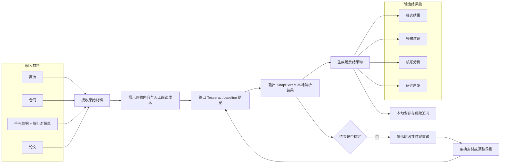

### 2.2 产品整体流程

#### 2.2.1 统一主故事

一位高敏知识工作者在日常工作中不断处理敏感资料。

他打开一份简历，想知道候选人是否值得继续推进；他收到一份合同，想尽快判断哪些条款需要确认或修改；他处理手写单据和银行对账单，想完成核对、验算和结果分析；他阅读论文，想判断这篇材料对自己的研究是否有直接价值。

这些任务虽然来自不同文档，但在演示和产品逻辑上都应遵循同一条链路：

`查看原始材料 → 查看 baseline 结果 → 查看 SnapExtract 结果 → 输出场景结果物 → 本地留存与复用`

SnapExtract 的统一价值，不只是把内容识别出来，而是在本机把“原始资料”升级为“可判断、可汇报、可继续处理的结果”。

#### 2.2.2 场景在统一故事中的角色

| 场景 | 用户核心问题 | 用户最终想拿到的结果 |
|-|-|-|
| 简历 | 这个人值不值得继续推进 | 信息卡片、综合评价、面试问题 |
| 合同 | 这份条款能不能签、哪些地方要改 | 信息提取、风险点识别、建议 |
| 对账单 | 账是否对得上、资金是否有异常 | 手写单据识别结果、银行对账单结构化结果、比对结果、验算结果、分析结果 |
| 论文 | 这篇材料对我的研究有没有直接价值 | 研究问题、使用方法、核心结果、对自己论文的作用 |

#### 2.2.3 主流程

#### 2.2.4 产品组织原则

这版产品描述围绕四条原则展开：

1. 同一套工作台处理四类高敏资料；
2. 同一套对照链路展示原始材料、baseline 和结果物之间的差异；
3. 同一套结果结构服务判断、汇报和留存；
4. 体验增强能力服务理解，不喧宾夺主。
